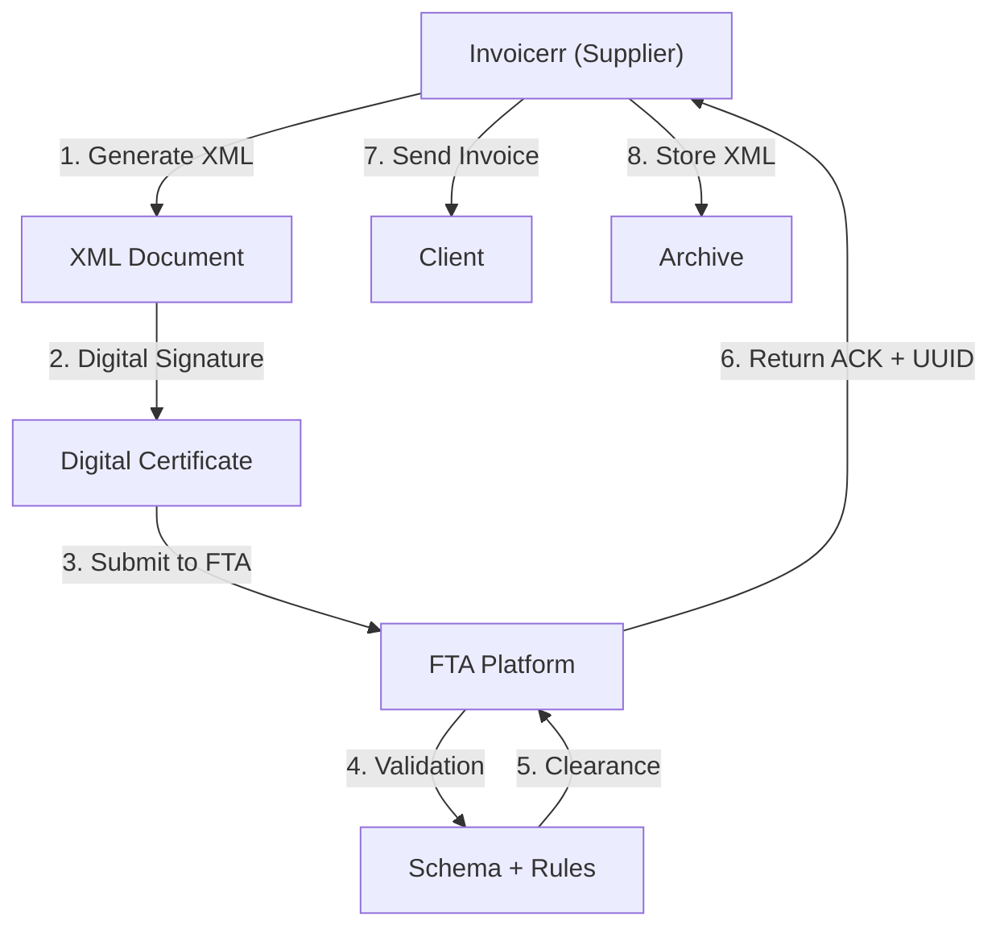

# 🇦🇪 United Arab Emirates - E-Invoicing Specifications (FTA e-Invoicing)

**Status:** 🔴 **Mandatory Clearance** | Active
**Authority:** FTA (Federal Tax Authority)
**Platform:** e-Invoice Management System

---

## 1. Context & Overview

The UAE implemented mandatory e-invoicing through the FTA. The system follows a **Clearance Model** requiring real-time validation for B2B transactions. The mandate applies to all businesses registered for VAT.

| Date | Scope | Obligation |
| --- | --- | --- |
| **2021+** | Progressive | Initial VATregistered businesses |
| **2023+** | All VAT taxpayers | Full mandatory e-invoicing |
| **Ongoing** | B2B Clearance | Real-time validation required |
| **2025** | B2C Framework | Consumer invoice framework |

---

## 2. Technical Workflow (Clearance Model)

### 🧱 Key Components

1. **e-Invoice Reference Number (IRN):** Unique identifier
2. **Digital Certificate:** FTA-approved
3. **XML Format:** UBL 2.1 with FTA extensions
4. **Clearance:** Real-time validation

---

## 3. Data Standards & Formats

### A. Required Format

- **XML Format:** UBL 2.1 with FTA customization
- **Encoding:** UTF-8
- **Digital Signature:** Required

### B. Document Types

| Type | Description |
| --- | --- |
| **Tax Invoice** | Standard B2B/B2G |
| **Simplified Tax Invoice** | B2C |
| **Credit Note** | Adjustments |
| **Debit Note** | Adjustments |

### C. Critical Data Fields

- **TRN:** Tax Registration Number (15 digits)
- **VAT Rate:** 5% standard, 0% exports
- **IRN:** Unique reference number
- **Invoice Date:** ISO 8601

---

## 4. Business Model & Compliance

### A. Workflow

1. **TRN Registration:** Obtain UAE tax ID
2. **Certificate:** Acquire FTA digital certificate
3. **XML Generation:** Create UBL document
4. **Signing:** Apply electronic signature
5. **Submission:** Send to FTA
6. **Delivery:** Send to buyer

### B. Archiving

- **Retention:** 6 years
- **Format:** Original XML

---

## 5. Implementation Checklist

- [ ] **TRN Registration:** Obtain UAE tax ID
- [ ] **Digital Certificate:** Acquire FTA certificate
- [ ] **UBL 2.1 Engine:** Build XML generator
- [ ] **Signature Integration:** Implement signing
- [ ] **FTA API:** Connect to platform
- [ ] **Document Types:** Support all invoice types

---

## 6. Resources

- **FTA Portal:** [Tax.gov.ae](https://tax.gov.ae)
- **e-Invoicing Section:** [FTA E-Invoicing](https://tax.gov.ae/en/businesses/e-invoicing/)
