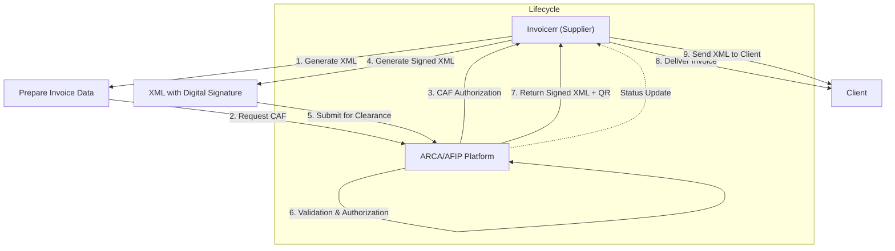

# 🇦🇷 Argentina - E-Invoicing Specifications (AFIP/ARCA Sistema de Factura Electrónica)

**Status:** 🟢 **Mandatory** | Active
**Authority:** ARCA (formerly AFIP - Administración Federal de Ingresos Públicos)
**Platform:** AFIP Electronic Invoice System + ARCA New Platform

---

## 1. Context & Overview

Argentina has one of Latin America's most mature e-invoicing systems, originally launched in 2006. The system transitioned from AFIP to ARCA in 2024-2025, with ongoing regulatory updates. Argentina operates on a **Clearance Model** requiring pre-validation through the tax authority before invoice issuance.

| Date | Scope | Obligation |
| --- | --- | --- |
| **2006+** | Progressive rollout | Initial e-invoicing by category |
| **July 1, 2015** | VAT registered | Mandatory for all VAT taxpayers |
| **Dec 18, 2024** | GR 5616/2024 | Foreign currency transaction rules |
| **Jan 1, 2025** | GR 5614/2024 | Price display requirements (VAT breakdown) |
| **2025** | ARCA Transition | Migration to new ARCA platform |
| **Ongoing** | All businesses | Continuous AFIP/ARCA reporting |

---

## 2. Technical Workflow (Clearance Model)

Invoicerr must send invoices to ARCA/AFIP for pre-validation before delivery. CAF authorization is required for each invoice range.

### 🧱 Key Components

1. **CAF (Código de Autorización de Folio):** Pre-authorized invoice number range obtained from ARCA/AFIP
2. **CUIT (Clave Única de Identificación Tributaria):** 11-digit tax ID for all parties
3. **Digital Certificate:** Required for signing invoices (AFIP-issued or authorized providers)
4. **Electronic Signature:** Mandatory for all e-invoices
5. **WSFE/WSMTX:** Web services for invoice transmission

---

## 3. Data Standards & Formats

### A. Required Format

- **XML Format:** AFIP schema (based on CII/UBL concepts)
- **Encoding:** UTF-8
- **Digital Signature:** X.509 certificate with AFIP-compliant algorithms

### B. Document Types

| Code | Description | Usage |
| --- | --- | --- |
| **01** | Factura A | B2B with VAT (registered taxpayers) |
| **02** | Nota de Débito A | Debit note for A invoices |
| **03** | Nota de Crédito A | Credit note for A invoices |
| **04** | Factura B | B2C/B2B consumer (VAT included) |
| **05** | Nota de Débito B | Debit note for B invoices |
| **06** | Nota de Crédito B | Credit note for B invoices |
| **08** | Factura C | Exempt/Zero-rated |
| **11** | Factura de Exportación | Export invoice |
| **12** | Nota de Débito de Exportación | Export debit note |
| **13** | Nota de Crédito de Exportación | Export credit note |

### C. Critical Data Fields

- **CUITEmitter:** Seller's tax ID
- **CUITReceiver:** Buyer's tax ID (mandatory for A/B invoices)
- **Concepto:** Product (1), Service (2), Mixed (3)
- **DocTipo:** Buyer document type (CUIT, DNI, CUIL, etc.)
- **DocNro:** Buyer document number
- **ImporteTotal:** Total amount
- **ImporteIVA:** VAT amount
- **CondicionIVA:** VAT condition (IVA Responsable Inscripto, Consumidor Final, etc.)

---

## 4. Business Model & Compliance

### A. Clearance Workflow

1. **CAF Request:** Obtain authorization codes for invoice ranges
2. **Invoice Generation:** Create XML with all required fields
3. **Digital Signing:** Apply electronic signature
4. **Submission:** Send to ARCA/AFIP web services
5. **Authorization:** Receive CAE (Código de Autorización Electrónico)
6. **Delivery:** Send to client (XML, PDF, or printed)

### B. Special Considerations

- **Foreign Currency:** Must record exchange rate from National Bank of Argentina
- **VAT Breakdown:** Must show net price and VAT separately (GR 5614/2024)
- **Contingency Mode:** Offline mode when API unavailable (limited validity)
- **Point of Sale (POS):** Special requirements for retail transactions

### C. Archiving Requirements

- **Retention Period:** 10 years minimum
- **Format:** Original XML + CAE confirmation
- **Location:** Argentina (data sovereignty requirements)

---

## 5. Implementation Checklist

- [ ] **CUIT Registration:** Obtain and verify CUIT for all entities
- [ ] **Digital Certificate:** Acquire AFIP-compliant digital certificate
- [ ] **CAF System:** Implement CAF request and management logic
- [ ] **XML Engine:** Build XML generation for AFIP schemas
- [ ] **Signature Implementation:** Integrate digital signing with certificates
- [ ] **WS Integration:** Connect to AFIP/ARCA web services (WSFE/WSMTX)
- [ ] **Contingency Handling:** Implement offline mode logic
- [ ] **Client Delivery:** Support XML, PDF, and print formats
- [ ] **Status Tracking:** Monitor authorization status and CAE retrieval
- [ ] **Document Types:** Support all invoice types (A, B, C, Export)
- [ ] **Foreign Currency:** Implement exchange rate recording
- [ ] **VAT Display:** Ensure VAT breakdown compliance (GR 5614)

---

## 6. Resources

- **ARCA Portal:** [Arca.gob.ar](https://www.arca.gob.ar)
- **AFIP Legacy:** [Afip.gob.ar](https://www.afip.gob.ar)
- **Electronic Invoice Portal:** [Afip.gob.ar/ws](https://www.afip.gob.ar/ws)
- **Technical Specifications:** [Manual de Factura Electrónica AFIP](https://www.afip.gob.ar/factura/)
- **Developer Resources:** [WS Helper Documentation](https://www.afip.gob.ar/factura/electronic/help/)
