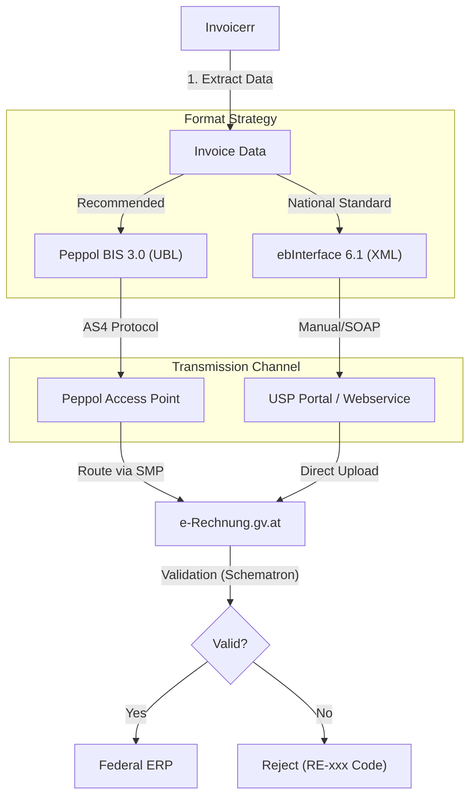

# 🇦🇹 Austria - Invoicing Specifications

**Status:** 🟢 **B2G Mandatory** (Since 2014) | ⚪ **B2B Voluntary** (Post-Audit)
**Authority:** BMF (Federal Ministry of Finance) / BRZ (Federal Computing Center)
**Platform:** [e-Rechnung.gv.at](https://www.e-rechnung.gv.at) / USP (Business Service Portal)

---

## 1. Context & Mandates

Austria is a pioneer in B2G e-invoicing. While B2B remains voluntary (standard Post-Audit rules), the close economic ties with Germany ("Shadow Mandate") drive the adoption of structured formats in the private sector.

| Scope | Status | Format | Note |
| --- | --- | --- | --- |
| **B2G (Federal)** | **Mandatory** | `ebInterface` or `Peppol` | Centralized via `e-Rechnung.gv.at`. |
| **B2G (States/Länder)** | **Mandatory** | `Peppol` (Preferred) | Since April 2020. |
| **B2B (Domestic)** | Voluntary | PDF / EDI / Peppol | Buyer consent required (Post-Audit). |

---

## 2. Technical Workflow (B2G)

The Federal Government ("Bund") uses a centralized hub. Foreign entities are strongly encouraged to use **Peppol** to avoid complex authentication on the local USP portal.

---

## 3. Data Standards & Formats

### A. The National Standard: `ebInterface`

* **Description:** A pure Austrian XML standard, flatter and simpler than UBL.
* **Versions:** 4.3, 5.0, 6.0, 6.1 (Current).
* **Usage:** Mostly used by local Austrian SMEs via the USP Portal upload.

### B. The International Standard: `Peppol BIS 3.0`

* **Description:** Standard UBL 2.1 with specific Austrian rules.
* **Constraint:** Must adhere to **CIUS-AT-GOV**.
* **Peppol ID:** ISO 6523 code `9915` (e.g., `9915:ATU12345678`).

### ⚠️ Critical Data Mapping (The "Gatekeepers")

For B2G, if these fields are missing, the invoice is **automatically rejected**.

| Business Term | German Term | Peppol (UBL) Path | ebInterface Path | Requirement |
| --- | --- | --- | --- | --- |
| **Order ID** | *Bestellnummer* | `cbc:OrderReference/cbc:ID` | `InvoiceRecipient/OrderReference/OrderID` | **Mandatory.** Usually 10 digits provided by the public buyer. |
| **Supplier ID** | *Lieferantennummer* | `cac:PartyIdentification/cbc:ID` | `Biller/InvoiceRecipientsBillerID` | **Mandatory.** Internal SAP ID assigned by the Gov to the supplier. |
| **VAT ID** | *UID-Nummer* | `cac:PartyTaxScheme/cbc:CompanyID` | `Biller/VATIdentificationNumber` | Must start with `ATU`. |

---

## 4. Implementation Checklist

* [ ] **Order ID Logic:** Ensure the UI forces the user to input a "PO Number" (Bestellnummer) when the client is an Austrian Public Entity.
* [ ] **Peppol Connectivity:** Ensure the Access Point can route to Austrian Government GLN (`0088:9910000000003`).
* [ ] **Validation:** Implement pre-flight checks for `CIUS-AT-GOV` to avoid async rejections.
* [ ] **Archive:** Store the generated XML (the legal original) for 7 years.

---

## 5. Resources

* **Official Portal:** [e-Rechnung.gv.at](https://www.e-rechnung.gv.at/)
* **Technical Specs (BRZ):** [USP / e-Rechnung Documentation](https://www.google.com/search?q=https://www.e-rechnung.gv.at/erb/technik)
* **ebInterface Standard:** [ebinterface.at](http://www.ebinterface.at/)
* **Validator:** [Official XML Validator](https://www.google.com/search?q=https://www.e-rechnung.gv.at/erb/validation)