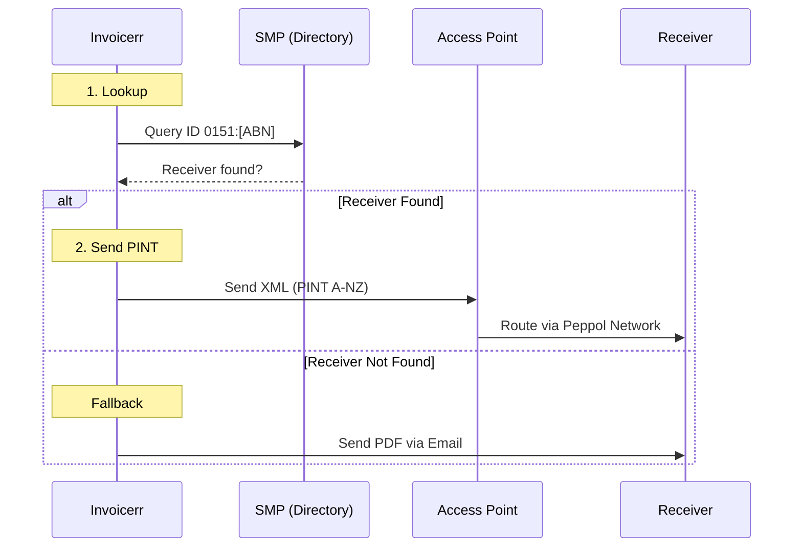

# 🇦🇺 Australia - Invoicing Specifications (Peppol / PINT A-NZ)

**Status:** 🟡 **Voluntary B2B** | 🟢 **Mandatory B2G Reception** (Gov must receive e-invoices)
**Authority:** ATO (Australian Taxation Office) / Peppol Authority
**Standard:** **Peppol PINT A-NZ** (Replaced BIS Billing 3.0 in 2025)

---

## 1. Context & Roadmap

Australia follows a "Post-Audit" model but is aggressively pushing Peppol adoption.
**Crucial Distinction:**

* **B2G:** Federal Agencies *must* be able to receive e-invoices. They pay faster (5 days) if you send e-invoices.
* **B2B:** Voluntary, but encouraged. "Business eInvoicing Right" (BER) was proposed but not mandated yet.
* **Standard:** Moved from Peppol BIS 3.0 to **PINT A-NZ** (Peppol International) to align with Japan/Singapore/NZ.

| Date | Scope | Obligation |
| --- | --- | --- |
| **Active** | **B2G** | Commonwealth entities must receive Peppol invoices. |
| **Active** | **B2B** | Voluntary adoption. Major ERPs (Xero, MYOB) support it natively. |
| **May 2025** | **Standard** | Old BIS Billing 3.0 deprecated. **PINT A-NZ** is mandatory. |

---

## 2. Technical Workflow (Peppol Only)

Australia relies entirely on the **Peppol Network**. There is no central government platform for clearing.

### 🧱 Key Components

1. **PINT A-NZ:** The new XML standard. It handles local tax specificities (GST) better than the generic EU format.
2. **ABN (Australian Business Number):** The primary identifier.
3. **RCTI (Self-Billing):** A common practice in Australia where the *buyer* issues the invoice. Supported by PINT.

---

## 3. Data Standards & Identifiers

### A. Identifiers (ICD 0151)

* **ABN:** 11 digits (e.g., `51824753556`).
* **Peppol Scheme:** **`0151`**.
* *Correct Endpoint ID:* `0151:51824753556`.

* **New Zealand Clients:** Use **NZBN** with scheme `0088`.

### B. Critical Fields

* **GST:** Standard rate is 10%. Code `S`. Export is `Z` or `G`.
* **Bank Details:** Must support **BSB** (Bank State Branch) + Account Number.
* **Buyer Reference:** Mandatory for B2G (Purchase Order).

### C. Migration to PINT

* **Namespace:** `urn:peppol:pint:billing-1@aunz-1`
* **Difference:** PINT is more flexible on tax categories and allows negative invoices more easily than BIS 3.0.

---

## 4. Implementation Checklist

* [ ] **Peppol Engine:** Upgrade the engine to support **PINT A-NZ**. Do not use the EU BIS 3.0 profile for Australia anymore.
* [ ] **BSB Support:** Add a specific field for "BSB" in the bank details section (Format: `XXX-XXX`).
* [ ] **Prefix Logic:** Hardcode `0151` prefix for Australian clients.
* [ ] **RCTI Support:** (Optional) If you serve industries like construction/farming, implement Recipient Created Tax Invoice logic (Self-billing).

---

## 5. Resources

* **Official Authority:** [ATO eInvoicing](https://www.ato.gov.au/business/e-invoicing/)
* **Technical Specs:** [A-NZ Peppol Github](https://github.com/A-NZ-PEPPOL/A-NZ-PEPPOL-BIS-3.0) (Check PINT migration guide)
* **Peppol Directory:** [Directory Lookup](https://directory.peppol.eu)
