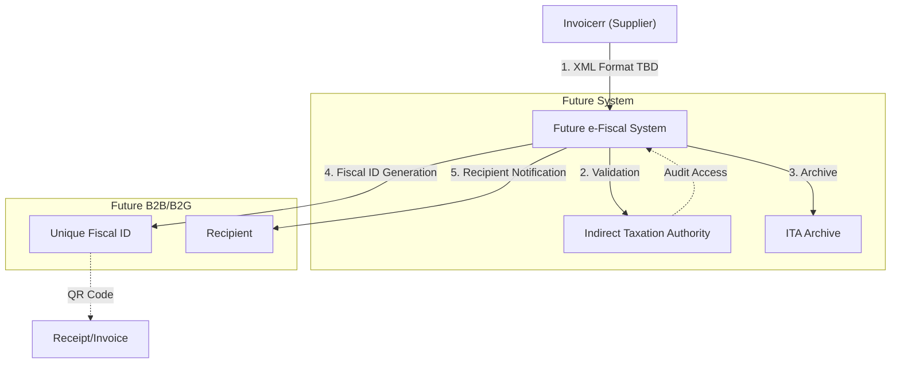

# 🇧🇦 Bosnia and Herzegovina - E-Invoicing Specifications

**Status:** 🔴 **Planned** | 🟡 **Under Development**
**Authority:** Indirect Taxation Authority (ITA)
**Platform:** TBD (To Be Determined)

---

## 1. Context & Overview

Bosnia and Herzegovina is developing an e-fiscalization system to combat tax fraud and modernize tax administration. The system is currently in planning stages with no mandatory timeline confirmed.

| Date | Scope | Obligation |
| --- | --- | --- |
| **TBD** | Framework | E-fiscalization law under development |
| **TBD** | B2G | Public sector e-invoicing requirements |
| **TBD** | B2B | Progressive extension to all B2B |
| **TBD** | E-fiscalization | Real-time transaction reporting |

---

## 2. Technical Workflow

### 🧱 Key Components

1. **Future e-Fiscal System:** Central platform under development
2. **Fiscal ID:** Unique identification for transactions
3. **ITA:** Indirect Taxation Authority (regulator)

---

## 3. Data Standards & Formats

### A. Expected Formats

* **XML format:** Likely UN/CEFACT or national schema
* **UBL 2.1:** Possible international standard adoption
* **QR Code:** Expected for receipt verification

### B. Expected Data Fields

* **TIN:** Bosnian tax ID
* **VAT Number:** VAT registration
* **Fiscal Number:** Unique transaction identifier

---

## 4. Business Model

* **Expected Model:** Fiscalization with real-time reporting
* **Hardware:** Potential certified fiscal device requirements
* **Timeline:** No confirmed mandatory dates

---

## 5. Implementation Checklist

* [ ] **Monitoring:** Track ITA announcements for framework details
* [ ] **Format Preparation:** Monitor regional standards (Serbia, Croatia)
* [ ] **System Planning:** Prepare ERP for XML e-invoice support
* [ ] **Hardware Assessment:** Evaluate fiscal device requirements
* [ ] **Timeline Tracking:** Watch for 2025-2026 development updates

---

## 6. Resources

* **Indirect Taxation Authority:** [Uino.gov.ba](https://www.uino.gov.ba)
* **Government:** [Gov.ba](https://www.gov.ba)
