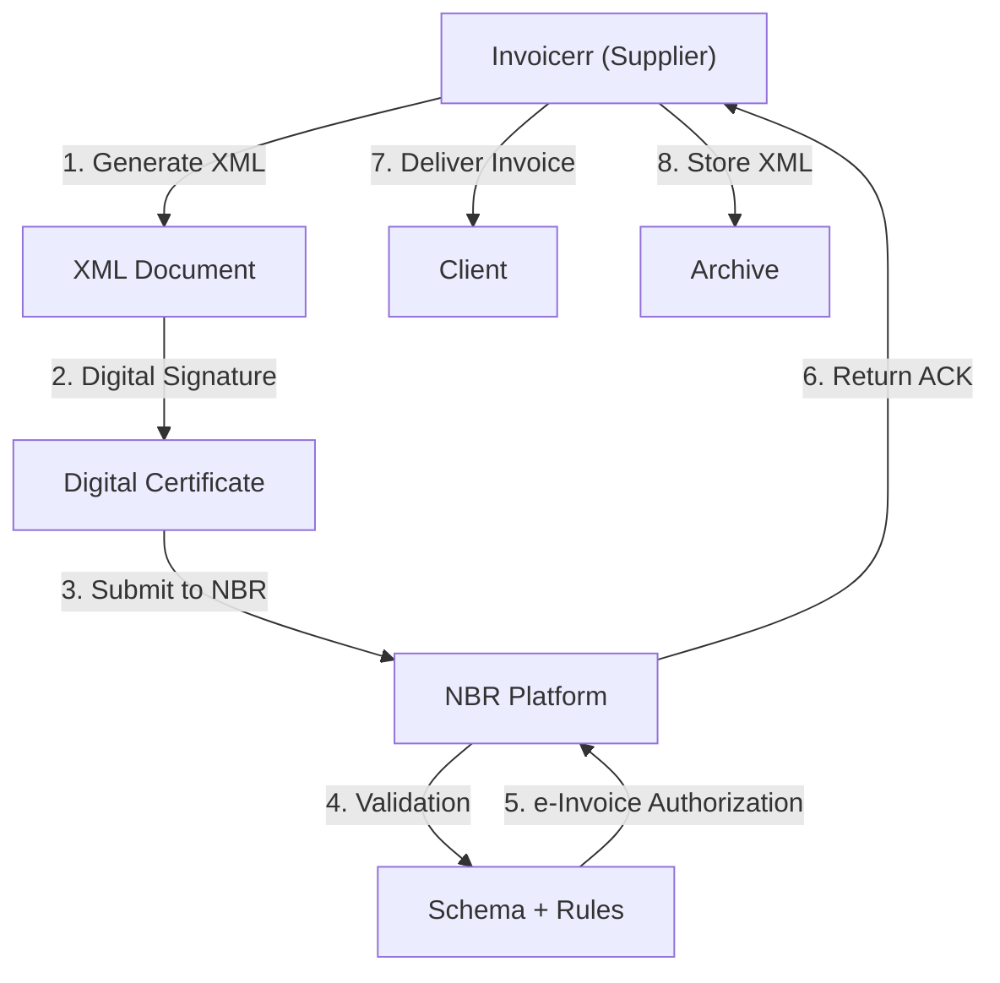

# 🇧🇩 Bangladesh - E-Invoicing Specifications (NBR e-Invoice)

**Status:** 🟢 **Mandatory** | Active for threshold-based taxpayers
**Authority:** NBR (National Board of Revenue)
**Platform:** e-Invoice System

---

## 1. Context & Overview

Bangladesh has implemented mandatory e-invoicing through the NBR. Large taxpayers and gradually more businesses are required to issue electronic invoices.

| Date | Scope | Obligation |
| --- | --- | --- |
| **2021+** | Large taxpayers | Mandatory e-invoicing |
| **Ongoing** | Progressive | Additional taxpayers included |

---

## 2. Technical Workflow (Clearance Model)

### 🧱 Key Components

1. **TIN (Tax Identification Number):** Required
2. **e-TIN Registration:** Required
3. **NBR Certification:** Required

---

## 3. Data Standards & Formats

### A. Required Format

- **XML Format:** NBR schema
- **Encoding:** UTF-8
- **Digital Signature:** Required

### B. Document Types

| Type | Description |
| --- | --- |
| **Tax Invoice** | Standard VAT invoice |
| **Credit/Debit Note** | Adjustments |

### C. Critical Data Fields

- **TIN:** Tax ID
- **e-Invoice Number:** Unique identifier
- **VAT Rate:** 15% standard

---

## 4. Business Model & Compliance

### A. Workflow

1. **TIN Registration:** Obtain Bangladeshi tax ID
2. **e-TIN Registration:** Register with NBR
3. **Certificate:** Acquire digital certificate
4. **XML Generation:** Create compliant document
5. **Signing:** Apply electronic signature
6. **Submission:** Send to NBR
7. **Delivery:** Send to buyer

### B. Archiving

- **Retention:** 5 years
- **Format:** Original XML

---

## 5. Implementation Checklist

- [ ] **TIN Registration:** Obtain Bangladeshi tax ID
- [ ] **e-TIN Registration:** Register with NBR
- [ ] **Digital Certificate:** Acquire certificate
- [ ] **XML Engine:** Build NBR schema generator
- [ ] **Signature Integration:** Implement signing
- [ ] **NBR API:** Connect to platform

---

## 6. Resources

- **NBR Portal:** [Nbr.gov.bd](https://www.nbr.gov.bd)
