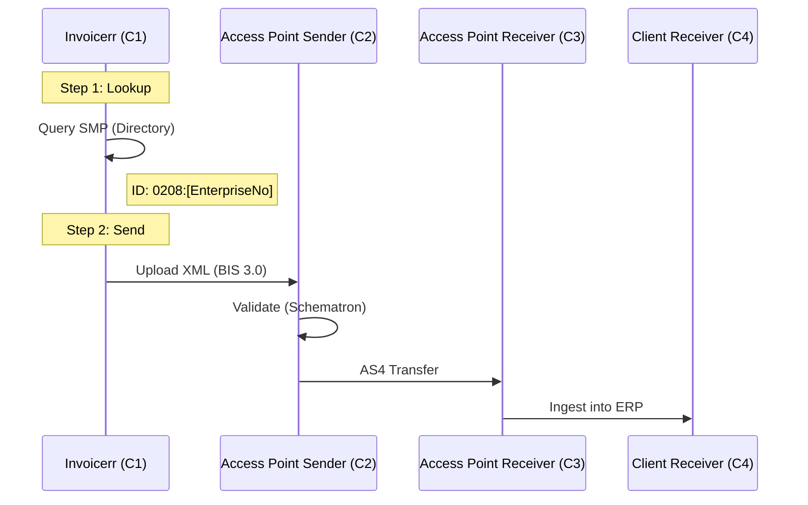

# 🇧🇪 Belgium - Invoicing Specifications

**Status:** 🔴 **B2B Mandatory (Jan 1, 2026)** | 🟢 **B2G Mandatory (Now)**
**Authority:** SPF Finances (Tax) / BOSA (Digital Transformation)
**Infrastructure:** **Peppol Network Only** (No central gov platform for B2B)

---

## 1. Context & Roadmap

Belgium is executing a "Big Bang" reform. Unlike France or Spain (phased by size), the mandate hits **all VAT-registered companies** simultaneously.

| Date | Scope | Description |
| --- | --- | --- |
| **Mar 2024** | **B2G** | Mandatory for all public procurement > €3,000. |
| **Dec 31, 2025** | **Shutdown** | "Hermes" platform (temporary email bridge) shuts down. |
| **Jan 01, 2026** | **B2B** | **Mandatory** emission & reception via Peppol for all domestic B2B. |
| **~2028** | *Reporting* | Expected transition to 5-Corner model (e-Reporting to Gov). |

---

## 2. Technical Workflow (Peppol 4-Corner)

Belgium uses the pure decentralized Peppol model. The Government does not sit in the middle of the transaction (unlike Italy).

---

## 3. Data Standards & Identifiers

### A. Format: `Peppol BIS Billing 3.0`

* **Description:** Standard UBL 2.1.
* **National Specs:** No complex "National CIUS". It is very close to the standard European profile.
* **Validation:** Standard OpenPeppol Schematron rules apply.

### B. Critical Fields (Mapping)

To ensure delivery, specific Belgian identifiers must be used.

| Business Term | Belgian Context | Peppol Path (UBL) | Requirement |
| --- | --- | --- | --- |
| **Receiver ID** | *Numéro d'entreprise / Ondernemingsnummer* | `cbc:EndpointID` | **Scheme:** `0208`. Value: 10 digits (e.g., `0123456789`). |
| **Payment Ref** | *Communication Structurée (VCS)* | `cbc:PaymentID` | Must follow `+++123/4567/89012+++` format if used. |
| **IBAN** | Bank Account | `cac:PayeeFinancialAccount/cbc:ID` | Mandatory if payment is via transfer. |

---

## 4. Implementation Checklist

* [ ] **Peppol Access Point:** Invoicerr MUST be connected to a certified Peppol AP.
* [ ] **Directory Lookup:** Implement a check against the Peppol Directory using Scheme `0208`.
* [ ] **Disable Email PDF:** For Belgian B2B clients after Jan 2026, disable "Send via Email" and force "Send via Peppol".
* [ ] **VCS Logic:** Add a specific field or validator for the "Structured Communication" payment reference.

---

## 5. Resources

* **Official Info:** [efacture.belgium.be](https://efacture.belgium.be/)
* **BOSA (Peppol Authority):** [BOSA Digital](https://bosa.belgium.be/en)
* **Peppol Directory:** [directory.peppol.eu](https://directory.peppol.eu)