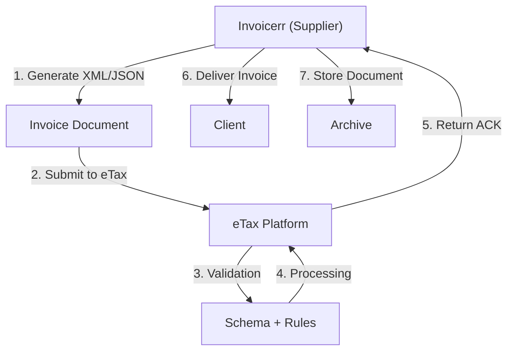

# 🇧🇭 Bahrain - E-Invoicing Specifications (eTax / NBR)

**Status:** 🟢 **Mandatory** | Active for all businesses
**Authority:** NBR (National Bureau for Revenue)
**Platform:** eTax Electronic System

---

## 1. Context & Overview

Bahrain has implemented mandatory e-invoicing through the eTax platform. The system aligns with GCC VAT requirements and focuses on real-time invoice reporting.

| Date | Scope | Obligation |
| --- | --- | --- |
| **2022+** | All businesses | Mandatory e-invoicing |
| **Ongoing** | Continuous | Real-time reporting |

---

## 2. Technical Workflow (Clearance Model)

### 🧱 Key Components

1. **TIN (Tax Identification Number):** 15 digits
2. **eTax Registration:** Required
3. **Invoice Format:** XML/JSON GCC standard

---

## 3. Data Standards & Formats

### A. Required Format

- **XML/JSON Format:** GCC standard
- **Encoding:** UTF-8
- **Digital Signature:** Required

### B. Document Types

| Type | Description |
| --- | --- |
| **Tax Invoice** | Standard VAT invoice |
| **Simplified Invoice** | B2C invoices |
| **Credit/Debit Note** | Adjustments |

### C. Critical Data Fields

- **TIN:** Tax ID (15 digits)
- **VAT Rate:** 10% standard
- **Invoice Number:** Unique identifier
- **Timestamp:** ISO 8601 format

---

## 4. Business Model & Compliance

### A. Workflow

1. **TIN Registration:** Obtain Bahraini tax ID
2. **eTax Registration:** Register on platform
3. **Document Generation:** Create invoice
4. **Submission:** Send to eTax
5. **Delivery:** Send to buyer

### B. Archiving

- **Retention:** 6 years
- **Format:** Original document

---

## 5. Implementation Checklist

- [ ] **TIN Registration:** Obtain Bahraini tax ID
- [ ] **eTax Registration:** Register on platform
- [ ] **API Integration:** Connect to eTax
- [ ] **Document Types:** Support all types

---

## 6. Resources

- **NBR Portal:** [Nbr.gov.bh](https://www.nbr.gov.bh)
- **eTax:** [Etax.nbr.gov.bh](https://etax.nbr.gov.bh)
