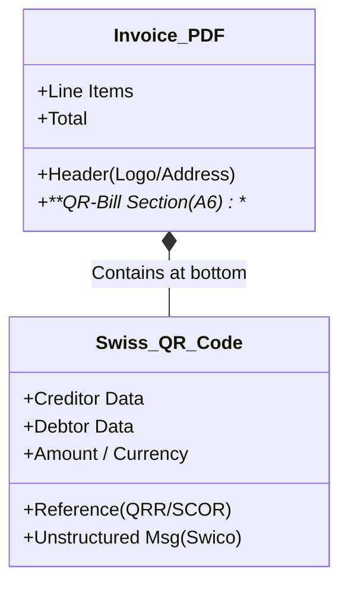

# 🇨🇭 Switzerland - Invoicing Specifications (QR-Bill / eBill)

**Status:** 🔴 **Mandatory Format (QR-Bill)** | 🟡 **Voluntary e-Invoicing (eBill)**
**Authority:** SIX Interbank Clearing / FTA (Federal Tax Administration)
**Standard:** **Swiss QR Code** (ISO 20022 compliant)

---

## 1. Context & Roadmap

Switzerland operates outside the EU VAT regime but is highly integrated.
**Crucial Distinction:**

* **Paper/PDF:** Still legal, but MUST contain the **Swiss QR Code** section. Old payment slips (ESR/BVR) are dead.
* **eBill:** The network for digital invoicing (B2C/B2B).
* **B2G:** Federal Gov requires e-invoicing for amounts > CHF 5,000.

| Date | Scope | Obligation |
| --- | --- | --- |
| **Active** | **All Invoices** | **QR-Bill** is the only accepted payment slip standard. |
| **Active** | **B2G** | Federal Administration requires e-invoices (e-rechnung). |
| **Active** | **B2C** | eBill is the dominant standard for recurring billing (Telco, Utility). |

---

## 2. Technical Workflow (The QR-Bill)

Invoicerr must generate a specific footer on the PDF invoice.

### 🧱 Key Components

1. **QR-IBAN:** A special IBAN variant (IID 30000-31999) used *only* with the QRR reference.
2. **QR Reference (QRR):** 27-digit numeric reference (legacy style). Requires QR-IBAN.
3. **SCOR (Creditor Reference):** ISO 11649 alphanumeric reference. Works with standard IBAN. **Recommended for Invoicerr.**
4. **Swico Codes:** Syntax to embed line-item data into the QR code for B2B automation (e.g., `/10/InvoiceNo /31/VATDate`).

---

## 3. The eBill Network (B2C / B2B)

For fully digital invoicing, Invoicerr can connect to the **eBill** network (run by SIX).

* **Workflow:** Invoicerr -> Network Partner (e.g., PostFinance/SIX) -> Client's Online Banking.
* **Identifier:** Using email or UID (B2B).

---

## 4. Implementation Checklist

* [ ] **QR-Bill Engine:**
* **Layout:** Must render an exact A6 section at the bottom of the PDF.
* **Swiss QR Code:** Generate the cross-shaped QR code with specific data structure.
* **Scissors Icon:** If printable, print the scissors line.

* [ ] **Reference Logic:**
* Implement **SCOR** (ISO 11649) generation. It's easier than QRR as it works with standard IBANs.

* [ ] **Data Validation:**
* **Addresses:** Street and Number must be separated or carefully parsed. "P.O. Box" handling is strict.

* [ ] **Swico Syntax:** Inject VAT details into the "Additional Information" field of the QR code using Swico tags (`/30/`, `/31/`) to help B2B clients automate booking.

---

## 5. Resources

* **Official Specs:** [PaymentStandards.CH](https://www.paymentstandards.ch/)
* **Validation Tool:** [QR-Bill Validator](https://www.google.com/search?q=https://www.paymentstandards.ch/en/shared/communication-grid.html)
* **Swico Syntax:** [Swico S1 Syntax](https://www.google.com/search?q=https://www.swico.ch/fr/connaissances/normes/facture-qr/)
