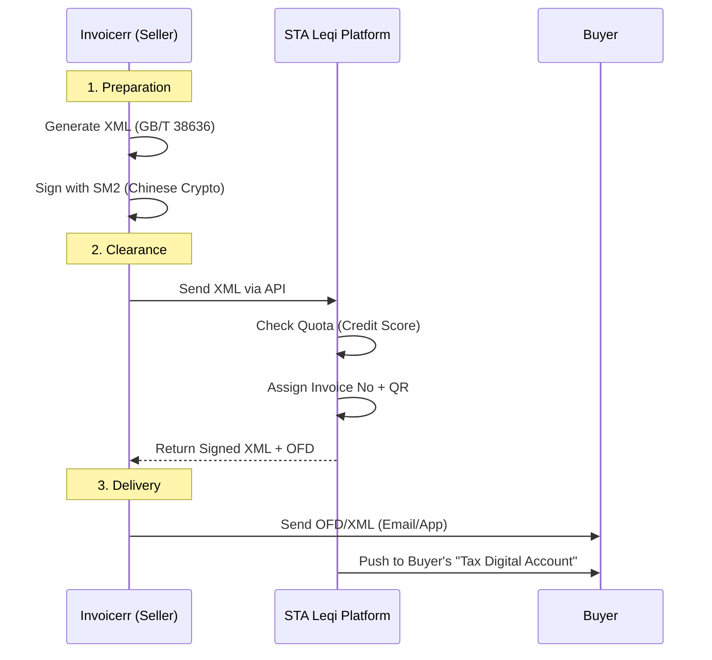

# 🇨🇳 China - Invoicing Specifications (Golden Tax System IV / e-Fapiao)

**Status:** 🔴 **Mandatory Clearance** (Fully Digitalized e-Fapiao)
**Authority:** STA (State Taxation Administration)
**Platform:** **Leqi Platform** (National E-Invoice Service Platform)

---

## 1. Context & Roadmap

China has transitioned from hardware-based invoicing (Tax Discs/U-Key) to a fully digitalized cloud system under **Golden Tax System Phase IV**.
**Crucial Shift:** No more paper fapiao, no more special red stamps. The XML file *is* the invoice.

| Date | Scope | Obligation |
| --- | --- | --- |
| **Active** | **Pilot** | Major regions (Shanghai, Guangdong, etc.) already live. |
| **Jan 1, 2026** | **National** | Full mandatory adoption for nearly all businesses (B2B/B2C). |
| **Ongoing** | **GTS IV** | AI-driven tax monitoring ("Managing tax by data"). |

---

## 2. Technical Workflow (Leqi Platform Clearance)

Emission is a real-time clearance process. You send data to the STA, and they return the signed, numbered invoice.

### 🧱 Key Components

1. **Fully Digitalized e-Fapiao:** A structured XML file signed by the STA. It does not require a physical seal.
2. **Leqi Platform:** The national cloud platform handling issuance, delivery, and validation.
3. **OFD (Open Fixed-layout Document):** The Chinese standard for fixed-layout documents (like PDF). This is the visual representation sent to humans.
4. **SM Series Crypto:** China uses national crypto standards (`SM2`, `SM3`) instead of RSA/SHA.

---

## 3. Quota Management (Dynamic Limits)

Unlike the old system (limit per invoice), the new system uses a **Total Monthly Amount**.

* **Dynamic:** Your quota is determined by your **Tax Credit Rating** (A, B, M, C, D).
* **Risk:** The AI monitors "Three Flows" consistency (Invoice, Cash, Goods). If suspicious, the quota is reduced instantly ("Sudden Reduction").

---

## 4. Red-Letter Fapiao (Credit Notes)

You cannot just issue a credit note. You must request a **Red-Letter Information Sheet** first.

* **If Buyer deducted VAT:** Buyer must initiate the request.
* **If Buyer did not deduct:** Seller initiates.
* **Workflow:** Submit Info Sheet -> STA Validates -> Seller issues Red-Letter Fapiao.

---

## 5. Implementation Checklist

* [ ] **Middleware:** Do not attempt direct API connection from overseas ERPs. Use a local middleware provider (e.g., Baiwang, Aisino) to handle SM2 crypto and API stability.
* [ ] **OFD Generator:** Ensure the system can render/store OFD files.
* [ ] **Quota Monitor:** Build a dashboard to track the remaining monthly invoice quota.
* [ ] **Red-Letter Logic:** Implement the "Information Sheet" workflow before allowing negative invoices.
* [ ] **Archiving:** Prepare for **30-year** retention of XML files (not just OFD/PDF). Data must reside in China.

---

## 6. Resources

* **Official Platform:** [Electronic Taxation Service](https://etax.chinatax.gov.cn/)
* **Standards:** [OFD Standard (GB/T 33190)](https://www.google.com/search?q=http://www.gb688.cn/)
