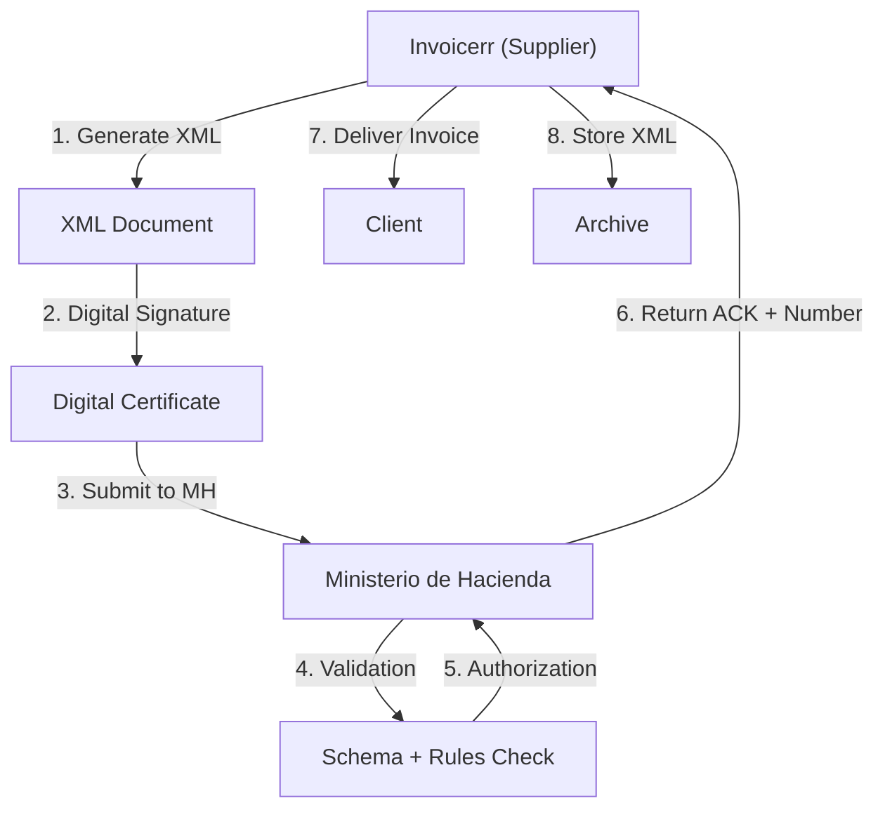

# 🇨🇷 Costa Rica - E-Invoicing Specifications (Factura Electrónica)

**Status:** 🟢 **Mandatory** | Active for all businesses
**Authority:** MH (Ministerio de Hacienda)
**Platform:** MH Electronic Invoice System

---

## 1. Context & Overview

Costa Rica has implemented mandatory e-invoicing (factura electrónica) through the Ministry of Hacienda. The system follows a **Clearance Model** requiring MH pre-authorization before invoice delivery. The rollout has been progressive since 2018.

| Date | Scope | Obligation |
| --- | --- | --- |
| **2018+** | Progressive | Initial rollout by sector |
| **Ongoing** | All businesses | Continuous MH authorization |
| **Current** | Full mandatory | All transaction types |

---

## 2. Technical Workflow (Clearance Model)

### 🧱 Key Components

1. **Digital Certificate:** MH-approved certificates
2. **XML Schema:** Hacienda national schema
3. **Sequential Numbering:** Mandatory consecutive numbers
4. **Authorization:** MH pre-validation

---

## 3. Data Standards & Formats

### A. Required Format

- **XML Format:** MH national schema
- **Encoding:** UTF-8
- **Digital Signature:** Required

### B. Document Types

| Code | Type | Description |
| --- | --- | --- |
| **01** | Factura Electrónica | Standard invoice |
| **02** | Nota Débito Electrónica | Debit note |
| **03** | Nota Crédito Electrónica | Credit note |
| **04** | Tiquete Electrónico | Electronic receipt |

### C. Critical Data Fields

- **Cédula Jurídica:** Business ID (10 digits)
- **Nombre:** Legal name
- **Dirección:** Address
- **IVA:** VAT (13%)
- **Código Moneda:** Currency

---

## 4. Business Model & Compliance

### A. Workflow

1. **Certificate:** Obtain MH digital certificate
2. **XML Generation:** Create schema-compliant document
3. **Signing:** Apply electronic signature
4. **Submission:** Send to MH for authorization
5. **Delivery:** Send to buyer

### B. Archiving

- **Retention:** 5 years
- **Format:** Original XML

---

## 5. Implementation Checklist

- [ ] **Cédula Jurídica:** Obtain business registration
- [ ] **Digital Certificate:** Acquire MH certificate
- [ ] **XML Engine:** Build schema generator
- [ ] **Signature Integration:** Implement signing
- [ ] **MH API:** Connect to web services
- [ ] **Document Types:** Support all types

---

## 6. Resources

- **Ministerio de Hacienda:** [Hacienda.go.cr](https://www.hacienda.go.cr)
- **E-Invoicing Portal:** [Hacienda.gob.pe/factura-electronica](https://www.hacienda.gob.pe/factura-electronica/)
