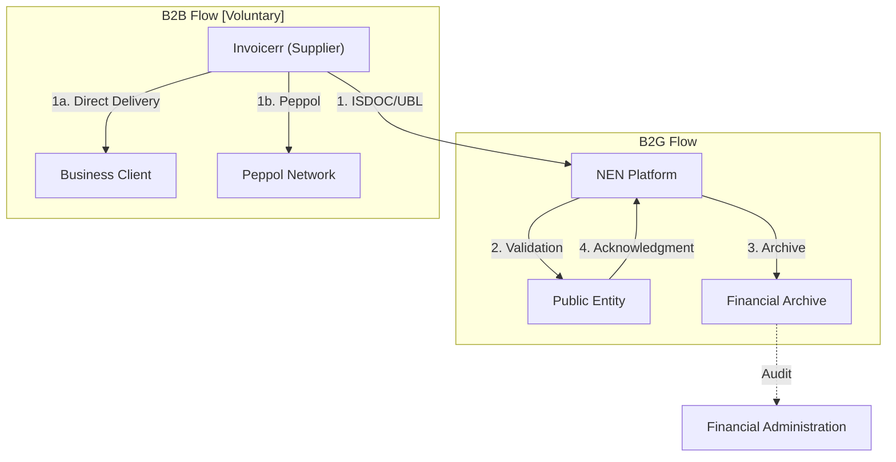

# 🇨🇿 Czech Republic - E-Invoicing Specifications

**Status:** 🟢 **B2G Active** | 🔴 **B2B Voluntary** | 🟡 **ViDA 2030-2035**
**Authority:** Financial Administration (Finanční správa)
**Platform:** NEN (Národní Elektronický Nástroj)

---

## 1. Context & Overview

Czech Republic has mandatory B2G e-invoicing via the NEN platform. B2B e-invoicing is voluntary with no real-time reporting. The ERS (Electronic Registration of Sales) was abolished in 2023.

| Date | Scope | Obligation |
| --- | --- | --- |
| **Oct 2016** | B2G | Public bodies must accept EN 16931 e-invoices |
| **Apr 2019** | B2G All | All public entities must receive e-invoices |
| **Jan 2023** | ERS Abolished | Real-time sales reporting discontinued |
| **2030** | Cross-border B2B | ViDA mandatory e-invoicing |
| **2035** | All B2B | Full domestic B2B mandate |

---

## 2. Technical Workflow

### 🧱 Key Components

1. **NEN Platform:** National public procurement e-invoicing system
2. **ISDOC Format:** Czech national XML format
3. **Peppol Network:** Cross-border interoperability

---

## 3. Data Standards & Formats

### A. Accepted Formats

* **ISDOC** ≥ 5.2 (Czech national standard)
* **UBL 2.1** syntax
* **EDIFACT** format
* **Peppol BIS Billing 3.0**

### B. Critical Data Fields

* **IČ:** Czech business ID (8 digits)
* **DIČ:** Czech VAT number
* **Invoice Number:** Unique identifier

---

## 4. Business Model

* **B2G Post-Audit:** No real-time clearance required
* **B2B Post-Audit:** Voluntary, no current mandate

---

## 5. Implementation Checklist

* [ ] **NEN Registration:** Register for NEN platform access
* [ ] **ISDOC Implementation:** Support Czech national format
* [ ] **Peppol Setup:** Obtain Peppol participant ID
* [ ] **ViDA Planning:** Prepare for 2030-2035 mandates
* [ ] **Archive Configuration:** Set up 10-year storage

---

## 6. Resources

* **Financial Administration:** [Financnisprava.cz](https://www.financnisprava.cz)
* **NEN Platform:** [Nen.cz](https://www.nen.cz)
* **EU ViDA:** [ec.europa.eu/vida](https://ec.europa.eu)
