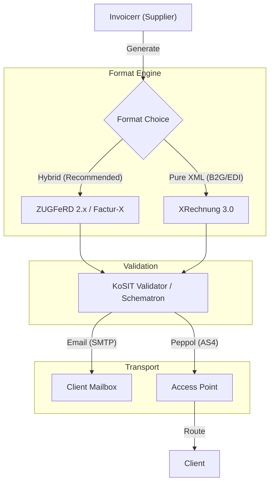

# 🇩🇪 Germany - Invoicing Specifications (ZUGFeRD & XRechnung)

**Status:** 🟡 **Voluntary Emission / Mandatory Reception (2025)**
**Authority:** BMF (Federal Ministry of Finance) / KoSIT (Standards)
**Key Law:** *Wachstumschancengesetz* (Growth Opportunities Act)

---

## 1. Context & Roadmap

Germany is transitioning from a "Post-Audit" model to a structured data model.
**Crucial Distinction:**

* **Reception:** Mandatory for ALL B2B companies starting **Jan 1, 2025**.
* **Emission:** Phased implementation.

| Date | Scope | Obligation |
| --- | --- | --- |
| **Jan 1, 2025** | **Emission** | Voluntary. Consent no longer required from buyer. |
| **Jan 1, 2027** | **Emission** | Mandatory for companies with turnover **> €800k**. |
| **Jan 1, 2028** | **Emission** | Mandatory for **ALL companies**. |

---

## 2. Technical Workflow (Decentralized)

Unlike Italy or Poland, Germany **does not** have a central clearance platform for B2B. Transmission is decentralized (Email, Peppol, Web).

---

## 3. Data Standards & Formats

Germany adheres strictly to **EN 16931**. Two main formats are permitted:

### A. The Hybrid: `ZUGFeRD 2.2+` (aka Factur-X)

* **Strategy:** **Recommended for broad B2B use.**
* **Structure:** PDF/A-3 file with an embedded XML (`CII` syntax).
* **Profile:** Must be at least **EN 16931** (Comfort). "Basic" profiles are insufficient for the new mandate.
* **Advantage:** Accepted by humans (PDF) and machines (XML). Interoperable with France.

### B. The Pure XML: `XRechnung 3.0`

* **Strategy:** Mandatory for **B2G** (Public Sector) and specific EDI partners.
* **Structure:** Pure XML (UBL or CII). No visual component.
* **Constraint:** Requires a visualization tool (viewer) for human readability.

### ⚠️ Critical Data Fields

To pass the KoSIT validator:

* **Buyer Reference (BT-10):** *Leitweg-ID* (B2G) or Order Number (B2B). Mandatory.
* **Tax Category:** Must use standard codes (`S` for Standard 19%, `Z` for Zero, `E` for Exempt).
* **Seller ID:** VAT ID (Umsatzsteuer-ID) starting with `DE`.

---

## 4. Transmission & Archiving (GoBD)

### Transmission Channels

1. **Email (SMTP):** Allowed. The "Invoice" is the attachment (XML or ZUGFeRD). The email body is irrelevant.
2. **Peppol:** Strongly recommended for automation.
* **Peppol ID:** Usually `0204:DE...` (VAT ID) or `0204:LeitwegID`.

### Archiving (GoBD Rules)

* **The Original:** The **XML** data is the legal original.
* **No Media Break:** You cannot print the XML and store the paper. You must store the digital file.
* **Immutability:** Storage must be WORM (Write Once Read Many).
* **Access:** Auditors (Z1/Z2/Z3) must be able to export the data (XML) during an audit.

---

## 5. Implementation Checklist

* [ ] **ZUGFeRD Engine:** Implement generation of ZUGFeRD 2.2 (Profile EN 16931). This covers 90% of use cases.
* [ ] **XRechnung Option:** Allow export of pure XRechnung XML for B2G clients.
* [ ] **Validator:** Integrate a Schematron validator (KoSIT rules) before sending.
* [ ] **Email Logic:** Ensure the system sends the file as an attachment to a dedicated address (e.g., `invoice@client.de`), not a personal one.
* [ ] **Master Data:** Add a field for "Leitweg-ID" (B2G routing ID) in the client profile.

---

## 6. Resources

* **ZUGFeRD / FeRD:** [Ferd-net.de](https://www.ferd-net.de/)
* **KoSIT (Standards & Validator):** [XRechnung Standard](https://www.xoev.de/xrechnung-16828)
* **Official Validator:** [KoSIT Validator Configuration](https://github.com/itplr-kosit/validator-configuration-xrechnung)