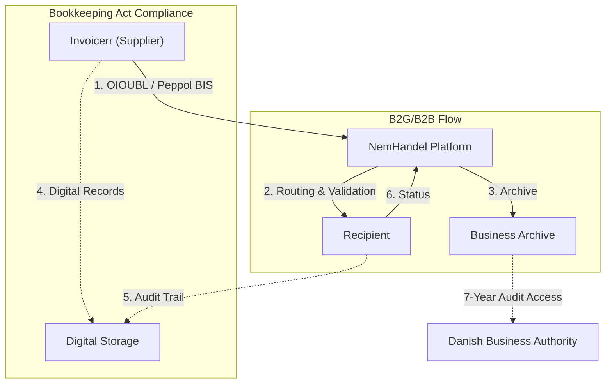

# 🇩🇰 Denmark - E-Invoicing Specifications

**Status:** 🟢 **B2G Mandatory** | 🟡 **B2B Acceptance Mandatory** | 🟡 **Full B2B 2027+**
**Authority:** Danish Business Authority (Erhvervsstyrelsen)
**Platform:** NemHandel / Peppol Network

---

## 1. Context & Overview

Denmark is a pioneer in e-invoicing with mandatory B2G since 2005. The Bookkeeping Act 2022 introduces phased B2B requirements with mandatory e-invoice acceptance and digital bookkeeping.

| Date | Scope | Obligation |
| --- | --- | --- |
| **2005** | B2G | Mandatory e-invoicing for public sector |
| **2019** | B2G All | All public entities must receive e-invoices |
| **Jan 2024** | Large/Medium | Digital bookkeeping mandatory |
| **Jan 2025** | Receiving | Mandatory e-invoice receiving capability |
| **Jan 2026** | Small companies | Digital bookkeeping mandatory (turnover > DKK 300K) |
| **2027-2028** | B2B | Full mandatory B2B e-invoicing expected |

---

## 2. Technical Workflow

### 🧱 Key Components

1. **NemHandel:** National e-invoicing infrastructure
2. **Peppol Interoperability:** Connected to Peppol network
3. **Digital Bookkeeping:** Mandatory under Bookkeeping Act 2022

---

## 3. Data Standards & Formats

### A. Accepted Formats

* **OIOUBL** 2.1 (Danish national UBL profile)
* **Peppol BIS Billing 3.0** (EN 16931 compliant)
* **UBL 2.1** syntax

### B. Critical Data Fields

* **CVR:** Danish business registration number
* **EAN Location Codes:** For B2G routing
* **NemID/MitID:** Authentication for government transactions

---

## 4. Business Model

* **Post-Audit Model:** No real-time clearance required
* **Mandatory Acceptance:** B2B recipients must accept e-invoices
* **Digital Bookkeeping:** Structured digital record keeping mandatory

---

## 5. Implementation Checklist

* [ ] **NemHandel Registration:** Register in NemHandelsregisteret
* [ ] **Peppol Access:** Set up Peppol access point
* [ ] **OIOUBL Support:** Implement Danish UBL format
* [ ] **Digital Bookkeeping:** Ensure ERP compliance with Act 2022
* [ ] **Archive Setup:** Configure 5-7 year digital storage

---

## 6. Resources

* **Danish Business Authority:** [Erhvervsstyrelsen.dk](https://erhvervsstyrelsen.dk)
* **NemHandel:** [Nemhandel.dk](https://www.nemhandel.dk)
* **Peppol Denmark:** [Peppol.dk](https://www.peppol.dk)
