# 🇩🇴 Dominican Republic - E-Invoicing Specifications (e-CF / NCF)

**Status:** 🟢 **Mandatory** | Active for all businesses
**Authority:** DGII (Dirección General de Impuestos Internos)
**Platform:** DGII Electronic Invoice System (e-CF)

---

## 1. Context & Overview

The Dominican Republic has mandatory e-invoicing (comprobante fiscal electrónico) through DGII. The system follows a **Clearance Model** requiring NCF (Número de Comprobante Fiscal) authorization. Progressive rollout began in 2018.

| Date | Scope | Obligation |
| --- | --- | --- |
| **2018+** | Progressive | Initial rollout by sector |
| **Ongoing** | All businesses | Continuous DGII authorization |
| **Current** | Full mandatory | All transaction types |

---

## 2. Technical Workflow (NCF Clearance)

```mermaid
flowchart TD
    S["Invoicerr (Supplier)"] -->|1. Generate XML| X[XML Document]
    X -->|2. Digital Signature| Cert[Digital Certificate]
    Cert -->|3. Request NCF| DGII[DGII Platform]
    
    DGII -->|4. Validate & Assign NCF| NCF[NCF Number]
    
    DGII -->|5. Return ACK + NCF| S
    
    S -->|6. Include NCF in XML| X2[Final Invoice]
    X2 -->|7. Deliver to Client| C[Client]
    S -->|8. Store XML| DB[Archive]
```

### 🧱 Key Components

1. **NCF (Número de Comprobante Fiscal):** Authorization number
2. **RNC (Registro Nacional de Contribuyentes):** Tax ID
3. **Digital Certificate:** DGII-approved
4. **e-CF:** Electronic tax document

---

## 3. Data Standards & Formats

### A. Required Format

- **XML Format:** DGII schema
- **Encoding:** UTF-8
- **Digital Signature:** Required

### B. Document Types

| Code | Type | Description |
| --- | --- | --- |
| **01** | Factura Fiscal | Standard invoice |
| **02** | Nota Débito | Debit note |
| **03** | Nota Crédito | Credit note |
| **04** | Factura Consumidor Final | Consumer invoice |
| **11** | Comprobante para Exportación | Export document |

### C. Critical Data Fields

- **RNC:** Tax ID (9-11 digits)
- **NCF:** Authorization number (19 digits)
- **ITBIS:** VAT (18%)
- **MontoTotal:** Total amount

---

## 4. Business Model & Compliance

### A. Workflow

1. **RNC Registration:** Obtain tax ID
2. **Certificate:** Acquire DGII digital certificate
3. **NCF Request:** Get authorization numbers
4. **Invoice Generation:** Create XML with NCF
5. **Signing:** Apply electronic signature
6. **Submission:** Send to DGII
7. **Delivery:** Send to buyer

### B. Archiving

- **Retention:** 5 years
- **Format:** Original XML

---

## 5. Implementation Checklist

- [ ] **RNC Registration:** Obtain Dominican tax ID
- [ ] **Digital Certificate:** Acquire DGII certificate
- [ ] **NCF System:** Implement authorization logic
- [ ] **XML Engine:** Build DGII schema generator
- [ ] **Signature Integration:** Implement signing
- [ ] **DGII API:** Connect to web services

---

## 6. Resources

- **DGII Portal:** [Dgii.gov.do](https://www.dgii.gov.do)
- **E-Invoicing Section:** [Comprobantes Fiscales Electrónicos](https://www.dgii.gov.do/categoria/comprobantes-fiscales/)
