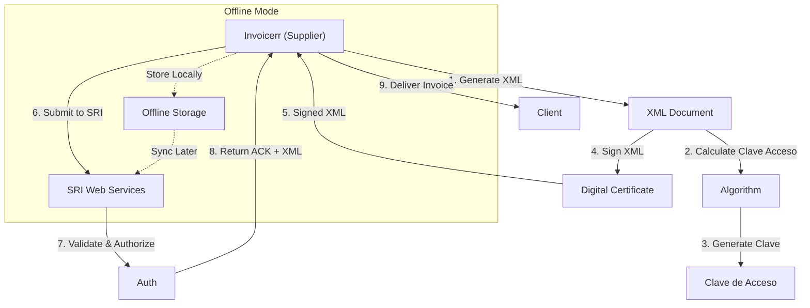

# 🇪🇨 Ecuador - E-Invoicing Specifications (Factura Electrónica)

**Status:** 🟢 **Mandatory** | Active for all businesses
**Authority:** SRI (Servicio de Rentas Internas)
**Platform:** SRI Electronic Invoice System

---

## 1. Context & Overview

Ecuador has mandatory e-invoicing (factura electrónica) through the SRI. The system follows a **Clearance Model** requiring authorization key (clave de acceso) validation. Progressive implementation began in 2014.

| Date | Scope | Obligation |
| --- | --- | --- |
| **2014+** | Progressive | Initial rollout by sector |
| **Ongoing** | All businesses | Continuous SRI authorization |
| **Current** | Full mandatory | All transaction types |

---

## 2. Technical Workflow (Authorization Key)

### 🧱 Key Components

1. **Clave de Acceso:** 49-digit authorization key
2. **RUC (Registro Único de Contribuyentes):** Tax ID
3. **Digital Certificate:** SRI-approved
4. **Offline Mode:** Contingency for connectivity issues

---

## 3. Data Standards & Formats

### A. Required Format

- **XML Format:** SRI schema
- **Encoding:** UTF-8
- **Digital Signature:** Required

### B. Document Types

| Code | Type | Description |
| --- | --- | --- |
| **01** | Factura | Standard invoice |
| **04** | Nota Débito | Debit note |
| **05** | Nota Crédito | Credit note |
| **07** | Guía de Remisión | Transport guide |
| **18** | Comprobante de Retención | Withholding receipt |

### C. Critical Data Fields

- **RUC:** Tax ID (13 digits)
- **Clave de Acceso:** 49-digit key
- **IVA:** VAT (12%)
- **ICE:** Special consumption tax
- **Código Establecimiento:** Branch code

---

## 4. Business Model & Compliance

### A. Workflow

1. **RUC Registration:** Obtain Ecuadorian tax ID
2. **Certificate:** Acquire SRI digital certificate
3. **Clave Calculation:** Generate 49-digit key
4. **XML Generation:** Create schema-compliant document
5. **Signing:** Apply electronic signature
6. **Submission:** Send to SRI (online or offline)
7. **Delivery:** Send to buyer

### B. Archiving

- **Retention:** 7 years
- **Format:** Original XML

---

## 5. Implementation Checklist

- [ ] **RUC Registration:** Obtain Ecuadorian tax ID
- [ ] **Digital Certificate:** Acquire SRI certificate
- [ ] **Clave Algorithm:** Implement 49-digit generation
- [ ] **XML Engine:** Build SRI schema generator
- [ ] **Signature Integration:** Implement signing
- [ ] **SRI API:** Connect to web services
- [ ] **Offline Storage:** Build contingency system

---

## 6. Resources

- **SRI Portal:** [Sri.gob.ec](https://www.sri.gob.ec)
- **E-Invoicing Section:** [Factura Electrónica](https://www.sri.gob.ec/factura-electronica)
