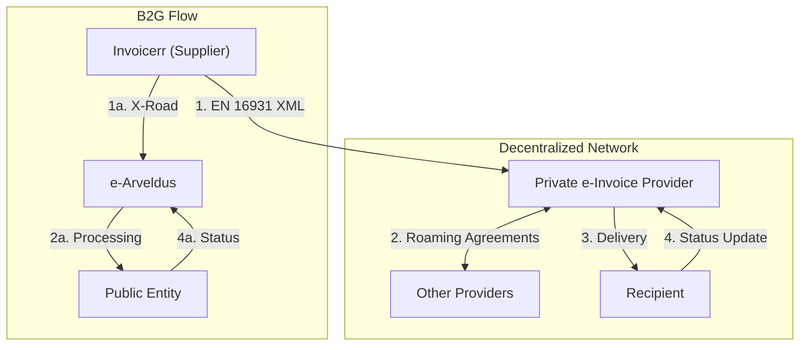

# 🇪🇪 Estonia - E-Invoicing Specifications

**Status:** 🟢 **B2G Active** | 🟡 **B2B Customer Option 2025** | 🟡 **Mandatory B2B 2027**
**Authority:** Tax and Customs Board (Maksu- ja Tolliamet)
**Platform:** e-Arveldus / Private Providers / Peppol

---

## 1. Context & Overview

Estonia has a highly digitalized tax system. B2G e-invoicing has been mandatory since 2019. The 2024 Accounting Act amendments introduce customer-driven B2B e-invoicing from July 2025, with full mandatory B2B from 2027.

| Date | Scope | Obligation |
| --- | --- | --- |
| **2019** | B2G | Mandatory e-invoicing for public sector |
| **Jul 2025** | B2B Customer | Suppliers must issue e-invoice if customer requests |
| **2027** | B2B All | Full mandatory B2B e-invoicing |
| **2030** | Cross-border | ViDA mandatory for intra-EU B2B |

---

## 2. Technical Workflow

### 🧱 Key Components

1. **Decentralized Network:** Multiple private providers (Billberry, E-arveldaja, etc.)
2. **X-Road Infrastructure:** Secure data exchange layer
3. **Roaming Agreements:** Inter-provider connectivity

---

## 3. Data Standards & Formats

### A. Accepted Formats

* **EN 16931** compliant XML (EU standard)
* **UBL 2.1** syntax
* **UN/CEFACT CII** format
* **EVS 923:** Estonian national XML standard

### B. Critical Data Fields

* **KMKR:** Estonian VAT number
* **Registry Code:** Business registration number
* **e-Invoice Address:** Provider-specific identifier

---

## 4. Business Model

* **Customer-Driven:** Buyer can request e-invoice
* **Decentralized:** No central platform, provider network model
* **X-Road Integration:** Secure government data exchange

---

## 5. Implementation Checklist

* [ ] **Provider Selection:** Choose e-invoice service provider
* [ ] **EN 16931 Compliance:** Implement EU standard format
* [ ] **X-Road Connection:** Set up secure government integration
* [ ] **Customer Request Handling:** Build workflow for e-invoice requests
* [ ] **Archive Setup:** Configure 7-year digital storage

---

## 6. Resources

* **Tax and Customs Board:** [Emta.ee](https://www.emta.ee)
* **e-Arveldus Portal:** [E-arve.ee](https://www.e-arve.ee)
* **X-Road:** [X-tee.ee](https://www.x-tee.ee)
* **Peppol Estonia:** Available via providers
