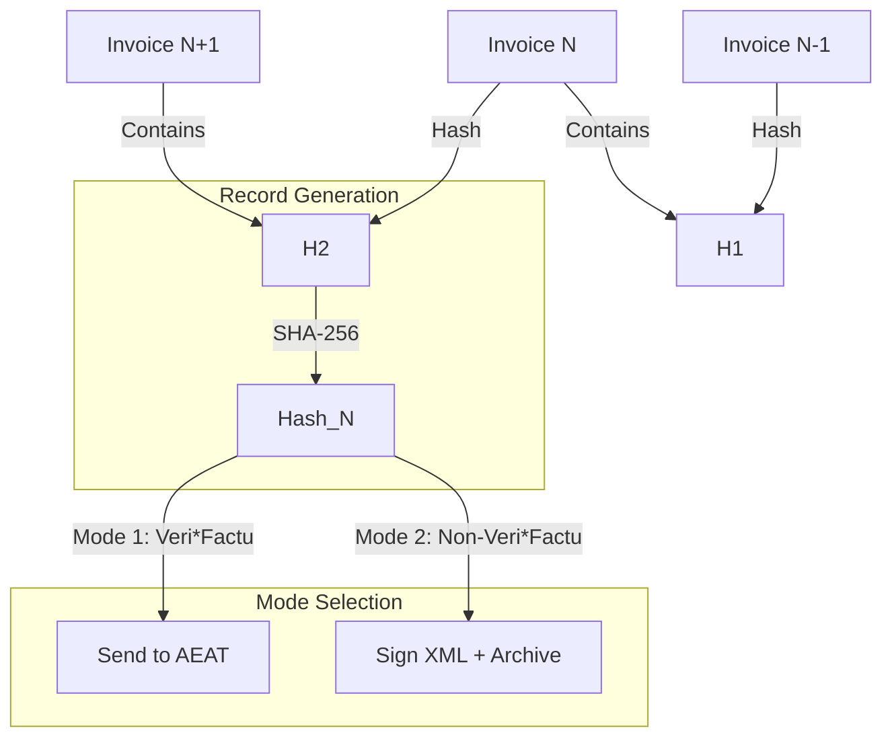

# 🇪🇸 Spain - Invoicing Specifications (Veri*Factu / Crea y Crece)

**Status:** 🟡 **Pilot Phase (Veri*Factu)** | 🔴 **Regional Mandates (TicketBAI)**
**Authority:** AEAT (Agencia Tributaria) / Haciendas Forales (Basque)
**Key Concepts:** **Chained Hash**, **QR Code**, **Veri*Factu**, **TicketBAI**.

---

## 1. Context & Roadmap

Spain is implementing a dual reform: Anti-fraud technical standards (Veri*Factu) and B2B e-invoicing commercial mandates (Crea y Crece).

| Date | Scope | Obligation |
| --- | --- | --- |
| **Active** | **TicketBAI** | Mandatory in **Basque Country** (since 2022/2024). |
| **Jul 29, 2025** | **Software** | Developers must only sell Veri*Factu compliant software. |
| **Jan 1, 2027** | **Veri*Factu** | Mandatory usage for companies (moved from 2026). |
| **2027+** | **B2B E-Invoicing** | Mandatory e-invoicing (Crea y Crece) for Large Enterprises (likely synced with Veri*Factu). |

---

## 2. Technical Workflow (Chained Integrity)

The core requirement is **Immutability**. You cannot modify a record without breaking the cryptographic chain.

### 🧱 Key Components

1. **Chained Hash:** `Hash(N) = SHA256( Data_N + Hash(N-1) )`. This creates a private blockchain.
2. **Veri*Factu Mode:** You send the XML record to AEAT instantly. **Benefit:** No need to sign the XML locally.
3. **Non-Veri*Factu Mode:** You keep the record locally. **Burden:** You MUST sign every XML (XAdES) and archive it securely.
4. **QR Code:** Mandatory on the PDF. Encodes the invoice data and a URL to verify it on the AEAT portal.

---

## 3. Data Standards & Visuals

### A. The XML Record (Alta)

* **Format:** Custom XML defined by AEAT (Ordre HAC/1177/2024).
* **Fields:** `ID` (Serie+Num+Date), `Type` (F1=Normal, F2=Simplified), `Breakdown` (Tax bases).
* **Software ID:** You must include the license/version of Invoicerr issuing the invoice.

### B. The QR Code

* **Dimensions:** 30x30mm to 40x40mm.
* **Content:** URL with parameters (`nif`, `numserie`, `fecha`, `importe`).
* **Validation:** Scanned by the client, it checks against AEAT servers if the invoice exists (in Veri*Factu mode).

---

## 4. Regional Exception: TicketBAI (Basque Country)

If the user is fiscally domiciled in the Basque Country (Álava, Guipúzcoa, Biscaye), Veri*Factu does **not** apply. You must use **TicketBAI**.

* **Differences:**
* **Always** send immediately (no "Non-Veri*Factu" mode).
* **Always** sign the XML (XAdES).
* **Specific Code:** TBAI ID and QR on the invoice.
* **Software:** Must be registered in the "Software Garante" registry of the specific province.

---

## 5. Implementation Checklist

* [ ] **Chaining Engine:** Implement the SHA-256 chaining logic. Ensure strict serialization (no gaps allowed).
* [ ] **Mode Switch:** Allow users to toggle "Send to AEAT" (Veri*Factu) vs "Local Archive" (Non-VF).
* [ ] **QR Generator:** Generate the QR code with the URL: `https://www2.agenciatributaria.es/...`.
* [ ] **Software Statement:** As a developer, you must provide a "Responsible Declaration" stating Invoicerr does not allow "phantom invoices".
* [ ] **TicketBAI Fork:** If targeting Basque clients, build a separate signing/sending module for the 3 provincial Haciendas.

---

## 6. Resources

* **Official Specs:** [Veri*Factu Technical Details](https://sede.agenciatributaria.gob.es/)
* **TicketBAI:** [TicketBAI Official Site](https://www.google.com/search?q=https://www.ticketbaigipuzkoa.eus/)
* **Validator:** [QR Verification Service](https://www2.agenciatributaria.es/wlpl/TIKE-CONT/ValidarQR)
