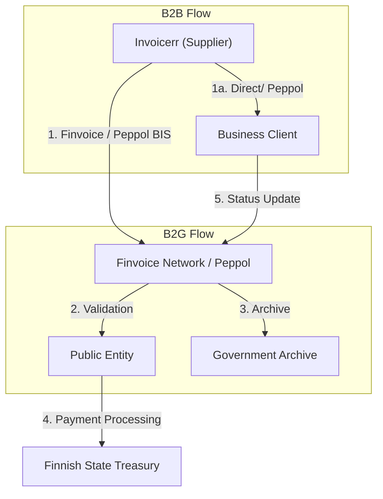

# 🇫🇮 Finland - E-Invoicing Specifications

**Status:** 🟢 **B2G Active** | 🟢 **B2B Widely Adopted** | 🟡 **ViDA 2030**
**Authority:** Tax Administration (Verohallinto)
**Platform:** Peppol / Finvoice Network

---

## 1. Context & Overview

Finland has mandatory B2G e-invoicing since 2010/2020. B2B e-invoicing is voluntary but has very high adoption rates. The country uses the national Finvoice standard and is advancing with Peppol Advanced Ordering.

| Date | Scope | Obligation |
| --- | --- | --- |
| **2010** | B2G Central | E-invoicing mandatory for central government |
| **2020** | B2G All | All public sector must receive e-invoices |
| **2021** | Peppol | Peppol Advanced Ordering for central government |
| **2024+** | B2B | Encouraged, high adoption rate |
| **2030** | B2B ViDA | Mandatory e-invoicing under ViDA directive |

---

## 2. Technical Workflow

### 🧱 Key Components

1. **Finvoice Network:** National e-invoicing infrastructure
2. **Peppol Connectivity:** International interoperability
3. **State Treasury:** Central payment processing for B2G

---

## 3. Data Standards & Formats

### A. Accepted Formats

* **Finvoice 3.0** (Finnish national standard)
* **TEAPPSXML 3.0** format
* **Peppol BIS Billing 3.0** (EN 16931 compliant)

### B. Critical Data Fields

* **Y-tunnus:** Finnish business ID (8 digits)
* **VAT Number:** ALV-numero
* **Operator ID:** e-invoice service provider identifier

---

## 4. Business Model

* **B2G Mandatory:** Structured e-invoices required for public sector
* **B2B Voluntary:** Highly recommended, widely adopted
* **Post-Audit Model:** No real-time clearance required

---

## 5. Implementation Checklist

* [ ] **Finvoice Support:** Implement Finnish national format
* [ ] **Peppol Access:** Set up Peppol access point
* [ ] **B2G Registration:** Register for government e-invoicing
* [ ] **ViDA Preparation:** Plan for 2030 mandate
* [ ] **Archive Setup:** Configure 6-7 year storage

---

## 6. Resources

* **Tax Administration:** [Vero.fi](https://www.vero.fi)
* **Finvoice:** [Finvoice.fi](https://www.finvoice.fi)
* **Peppol Finland:** [Peppol.fi](https://www.peppol.fi)
* **State Treasury:** [Valtiokonttori.fi](https://www.valtiokonttori.fi)
