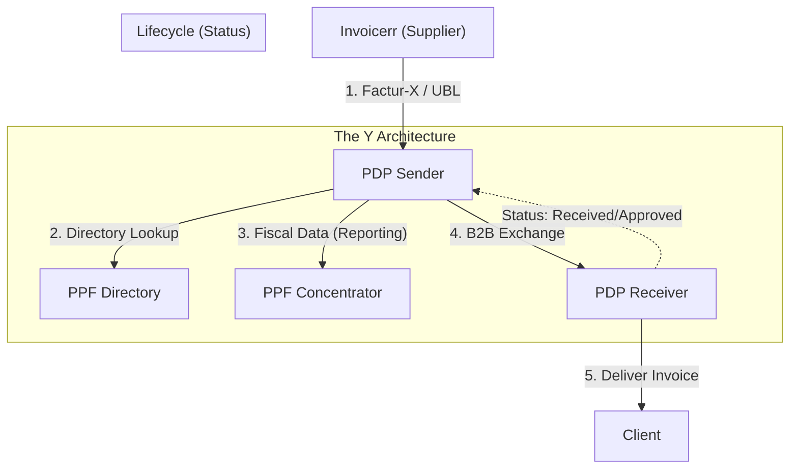

# 🇫🇷 France - Invoicing Specifications (Factur-X & PDP)

**Status:** 🟡 **Transition Phase** | 🔴 **Mandatory Reception (Sept 2026)**
**Authority:** DGFiP (Direction Générale des Finances Publiques)
**Platform:** **PDP** (Private Platforms) + **PPF** (Public Concentrator/Directory)

---

## 1. Context & Roadmap

France is shifting from a standard Post-Audit model to a **Clearance/Continuous Transaction Control (CTC)** model. The key pivot in late 2024 was the removal of the Public Portal (PPF) as a direct exchange hub for B2B.

| Date | Scope | Obligation |
| --- | --- | --- |
| **Sept 1, 2026** | **Reception** | **All companies** (including SMEs) must be able to receive e-invoices via a PDP. |
| **Sept 1, 2026** | **Emission** | Large Enterprises & Mid-Caps (ETI) must issue e-invoices. |
| **Sept 1, 2027** | **Emission** | SMEs & Micro-enterprises must issue e-invoices. |

---

## 2. Technical Workflow (The "Y" Model)

Invoicerr cannot send invoices directly to the client. It must connect to a **PDP** (Plateforme de Dématérialisation Partenaire).

### 🧱 Key Components

1. **PDP (Partner Platform):** Private certified platforms (ISO 27001). They handle the exchange, validation, and reporting. Invoicerr acts as an "OD" (Opérateur de Dématérialisation) connecting to a PDP.
2. **PPF (Public Portal):** Now acts solely as:
* **Directory:** Maps SIREN to PDP address.
* **Concentrator:** Receives fiscal data for VAT control.
* **B2G Hub:** Continues to run Chorus Pro for public sector invoicing.

---

## 3. Data Standards & Formats

France mandates the **EN 16931** standard. The "Minimal Core" includes three syntaxes:

### A. The Champion: `Factur-X` (Hybrid)

* **Description:** PDF/A-3 file with an embedded XML (`CII` syntax).
* **Advantage:** Readable by humans (PDF) and machines (XML). Perfect for SMEs.
* **Profiles:**
* `BASIC`: Not compliant for tax deduction.
* `EN 16931`: **Minimum required** for the mandate.
* `EXTENDED`: For complex supply chains.

### B. Pure XML

* **`UBL 2.1`:** Standard OASIS format.
* **`CII` (Cross Industry Invoice):** UN/CEFACT format.

### ⚠️ Critical Data Fields (V3.1 Specs)

New mandatory fields to avoid rejection:

* **Client SIREN:** The routing key.
* **Operation Type:** `Livraison de biens` (Goods) vs `Prestation de services` (Services).
* **Option TVA d'après les débits:** Must be explicitly stated if applicable.
* **Delivery Address:** Mandatory if different from billing address.

---

## 4. Lifecycle & E-Reporting

The invoice is a living object. You must update its status.

### A. Lifecycle Statuses (Mandatory)

* `Deposited`: Sent by Invoicerr.
* `Rejected`: Technical error.
* `Refused`: Business error (wrong price).
* **`Cashed` (Encaissée):** CRITICAL. For services, you must report when payment is received to trigger VAT liability.

### B. E-Reporting (Non-B2B Domestic)

For B2C sales or International B2B, you don't send the invoice to the platform, but you must send a **data summary**:

* **Frequency:** Decadal (every 10 days) for standard VAT regime.
* **Content:** Date, Amount, VAT, Currency.

---

## 5. Implementation Checklist

* [ ] **PDP Strategy:** Select a PDP partner to connect Invoicerr to. (We are an "OD").
* [ ] **Factur-X Engine:** Ensure PDF generation embeds the XML (Profile EN 16931).
* [ ] **Directory Logic:** Before sending, ping the PDP/PPF Directory to check if the client uses a specific PDP or Routing Code.
* [ ] **Lifecycle API:** Build webhooks to receive status updates (`Approved`, `Refused`) from the PDP.
* [ ] **Payment Reporting:** For Service providers, build a trigger to send the "Cashed" status when the bank transaction is reconciled.

---

## 6. Resources

* **Official Specs (FNFE-MPE):** [Fnfe-mpe.org](https://fnfe-mpe.org/factur-x/)
* **DGFiP Portal:** [Impots.gouv.fr (E-invoicing)](https://www.google.com/search?q=https://www.impots.gouv.fr/entrepreneur/facturation-electronique)
* **Chorus Pro (B2G):** [Chorus Pro Community](https://communaute.chorus-pro.gouv.fr/)