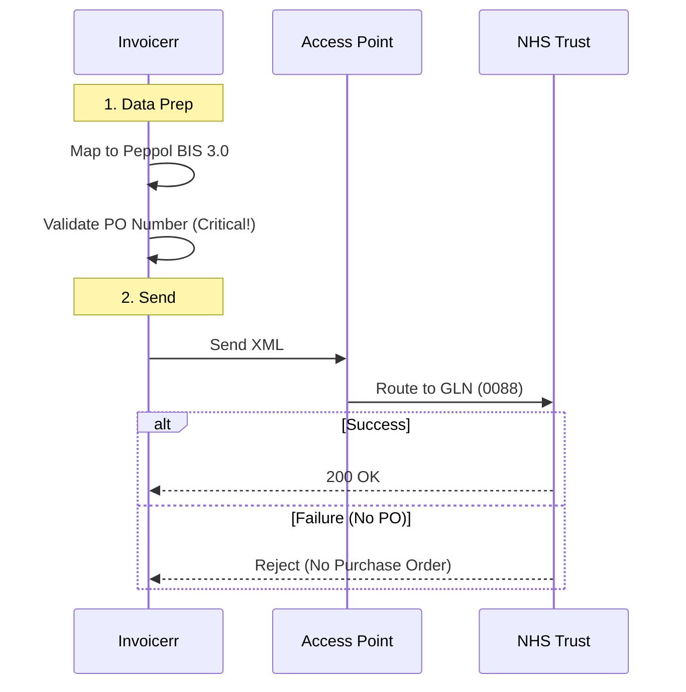

# 🇬🇧 United Kingdom - Invoicing Specifications (Peppol / MTD)

**Status:** 🟡 **Voluntary B2B** | 🟢 **Mandatory B2G (NHS)**
**Authority:** HMRC (Tax) / NHS (Health)
**Standard:** **Peppol BIS Billing 3.0**

---

## 1. Context & Roadmap

The UK is moving towards a B2B mandate, but for now, it is sector-specific.
**Crucial Distinction:**

* **MTD (Making Tax Digital):** Requires digital record-keeping and VAT return submission via API. It **does not** mandate sending electronic invoices to clients (PDF/Paper is fine).
* **NHS Mandate:** Suppliers to the NHS **must** send e-invoices via Peppol.
* **Procurement Act:** Public bodies must accept e-invoices.

| Date | Scope | Obligation |
| --- | --- | --- |
| **Active** | **NHS** | Mandatory for NHS suppliers (Peppol). |
| **Active** | **MTD** | Digital records required for VAT. |
| **Apr 2029** | **B2B** | Proposed universal B2B e-invoicing mandate. |

---

## 2. Technical Workflow (NHS / Peppol)

For NHS and progressive B2B, Invoicerr connects to the Peppol network.

### 🧱 Key Components

1. **Peppol BIS 3.0:** The standard UBL format.
2. **GLN (Global Location Number):** The ID used by NHS Trusts (Scheme `0088`).
3. **PO Number:** The NHS has a strict "No PO, No Pay" policy.

---

## 3. Data Standards & Identifiers

### A. Identifiers

* **NHS:** Uses GLN (13 digits). Scheme: `0088`.
* **B2B:** Uses VAT ID (GB...). Scheme: `9932`.

### B. Critical Fields (NHS)

* **Order Reference:** `cbc:OrderReference/cbc:ID`. **Mandatory.** Must match the PO issued by the Trust.
* **Delivery Point:** Often required to specify which hospital department.

---

## 4. Implementation Checklist

* [ ] **Peppol Engine:** Use the standard Peppol BIS 3.0 engine.
* [ ] **PO Field:** Force the user to input a "PO Number" if the client is flagged as NHS/Public.
* [ ] **GLN Logic:** Allow storing GLN (0088) in the client profile for routing.
* [ ] **MTD Export:** (Separate feature) Ensure Invoicerr can export a VAT report compatible with MTD bridging software (or integrate directly with HMRC API for VAT returns).

---

## 5. Resources

* **NHS SBS:** [NHS Shared Business Services](https://www.sbs.nhs.uk/)
* **Peppol Directory:** [Directory Lookup](https://directory.peppol.eu)
* **HMRC:** [Making Tax Digital](https://www.gov.uk/government/publications/making-tax-digital)
