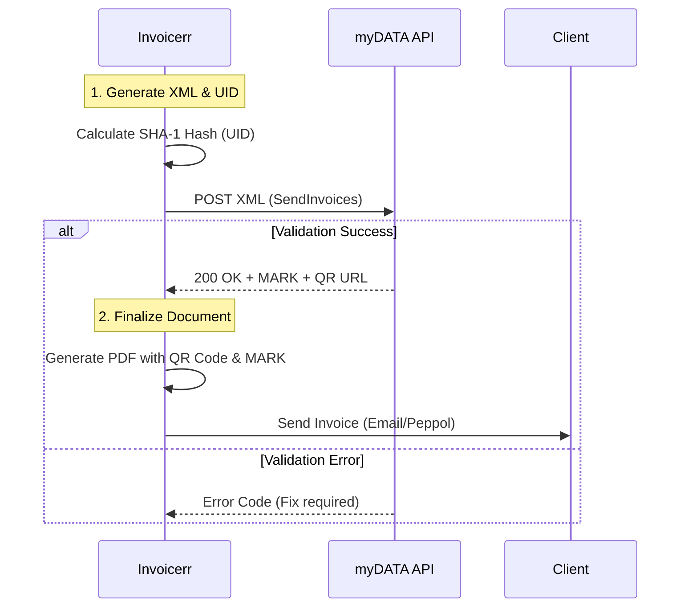

# 🇬🇷 Greece - Invoicing Specifications (myDATA & e-Delivery)

**Status:** 🟡 **Mandatory Reporting (Current)** | 🔴 **Mandatory e-Invoicing (2026)**
**Authority:** AADE (Independent Authority for Public Revenue)
**Platform:** **myDATA** (Digital Accounting & Tax Application)

---

## 1. Context & Roadmap

Greece is transforming its existing "myDATA" reporting system into a full **CTC (Continuous Transaction Controls)** e-invoicing mandate.

| Date | Scope | Obligation |
| --- | --- | --- |
| **Current** | **e-Reporting** | All companies must report invoice data summaries to myDATA (Post-issuance). |
| **Apr 2025** | **e-Delivery** | Digital Delivery Note (Deltio Apostolis) mandatory for large companies (>€200k). |
| **Feb 2026** | **e-Invoicing** | Mandatory B2B e-invoicing for **Large Enterprises** (>€1M turnover). |
| **Oct 2026** | **e-Invoicing** | Mandatory B2B e-invoicing for **All other companies**. |

---

## 2. Technical Workflow (Clearance via Reporting)

The core mechanism is obtaining the **MARK** (Unique Registration Number) from the AADE API.

### 🧱 Key Components

1. **MARK (Unique Registration Number):** An integer returned by AADE. Without a MARK, the invoice is fiscally invalid (non-deductible).
2. **UID (Unique Identifier):** A SHA-1 hash generated by Invoicerr *before* sending, to ensure uniqueness and prevent duplicates.
* *Formula:* `SHA1(IssuerVAT + Date + Branch + Type + Series + Number)`

3. **QR Code:** Mandatory on the visual representation (PDF). It encodes the URL to view the invoice on the AADE portal.

---

## 3. Data Standards & Classification

The complexity in Greece lies in the **Semantic Classification**. You don't just send "Product X"; you must map it to a Tax Classification.

### A. Invoice Types (Table 8.1)

You must select the correct code for each document:

* `1.1`: Sales Invoice (B2B Goods/Services)
* `2.1`: Service Invoice (Pure Services)
* `5.1`: Credit Note (Associated)
* `5.2`: Credit Note (Non-associated / Volume rebate)

### B. Income & Expense Classification (E3 Mapping)

Every line item must have an `IncomeClassification` code that maps to the E3 Tax Form.

* *Example:* Sales of Goods -> `category1_1` -> `E3_561_001`.
* **Invoicerr Logic:** The user must select a "Tax Category" for their items in the UI, which maps to these codes in the backend.

---

## 4. Transmission Methods

Invoicerr can support two main paths:

### Method A: ERP / Direct Connection (REST API)

* **Protocol:** REST over HTTPS.
* **Auth:** `aade-user-id` + `ocp-apim-subscription-key`.
* **Pros:** Free, direct control.
* **Cons:** Invoicerr must maintain the code for every API change (frequent updates).

### Method B: Certified Provider (YPAH)

* **Protocol:** Connect to a certified third-party provider.
* **Pros:** Includes **B2G** connectivity (Peppol) and Digital Signature (Qualified). Incentivized by the state (Tax benefits).
* **Cons:** Cost per invoice.

---

## 5. Implementation Checklist

* [ ] **UID Engine:** Implement the SHA-1 hashing algorithm for the `UID` based on the 6 mandatory fields.
* [ ] **Classification UI:** Add a dropdown in the Invoice Editor for "Income Classification" (e.g., Sale of Goods vs Services).
* [ ] **API Connector:** Build the connector to `mydatapi.aade.gr` (SendInvoices endpoint).
* [ ] **QR Code Generator:** Implement logic to take the `qrCodeUrl` returned by the API and render it onto the PDF.
* [ ] **Error Handling:** Handle specific AADE errors (e.g., VAT mismatch) and display them clearly to the user.
* [ ] **e-Delivery (Future):** Prepare architecture for "Real-time shipping" (Phase 2) which requires sending data *before* the truck leaves.

---

## 6. Resources

* **Developer Portal:** [myDATA Developers](https://www.google.com/search?q=https://mydata-dev.portal.azure-api.net/)
* **Technical Specs:** [AADE Technical Documentation](https://www.google.com/search?q=https://www.aade.gr/mydata/texnikes-prodiagrafes)
* **Timologio (Test App):** [Timologio Web App](https://www.aade.gr/timologio)