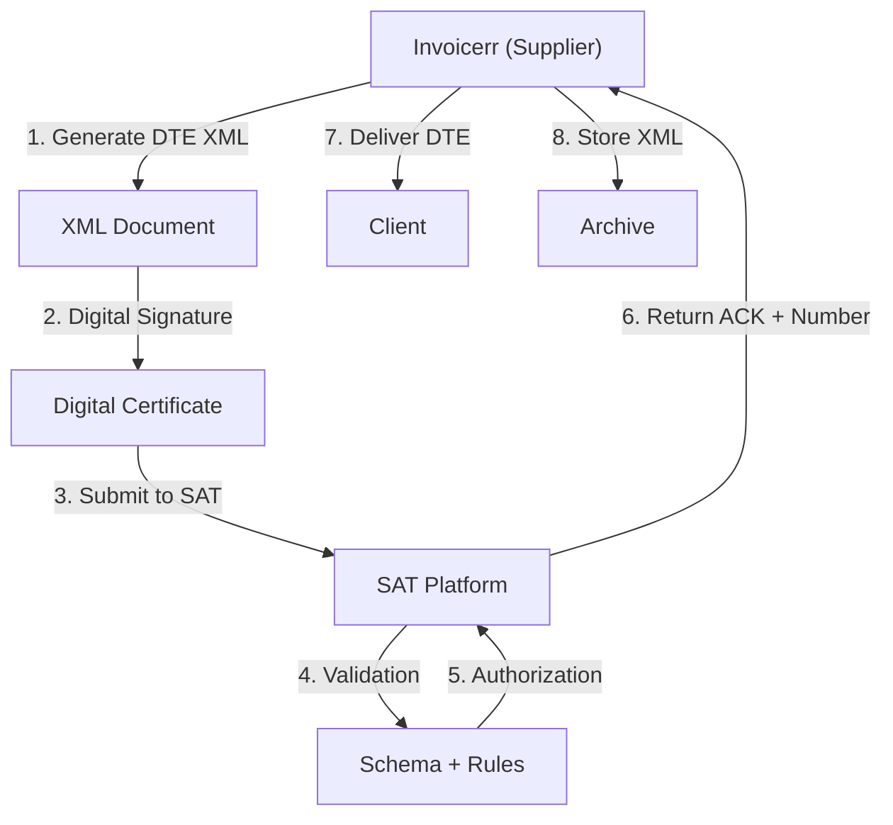

# 🇬🇹 Guatemala - E-Invoicing Specifications (DTE)

**Status:** 🟢 **Mandatory** | Active for all businesses
**Authority:** SAT (Superintendencia de Administración Tributaria)
**Platform:** SAT Electronic Invoice System (DTE)

---

## 1. Context & Overview

Guatemala has mandatory e-invoicing (documento tributario electrónico - DTE) through SAT. The system follows a **Clearance Model** requiring pre-authorization. Progressive rollout began in 2017.

| Date | Scope | Obligation |
| --- | --- | --- |
| **2017+** | Progressive | Initial rollout by sector |
| **Ongoing** | All businesses | Continuous SAT authorization |
| **Current** | Full mandatory | All transaction types |

---

## 2. Technical Workflow (DTE Clearance)

### 🧱 Key Components

1. **DTE (Documento Tributario Electrónico):** Electronic tax document
2. **NIT (Número de Identificación Tributaria):** Tax ID
3. **Digital Certificate:** SAT-approved
4. **Firma Electrónica:** Electronic signature

---

## 3. Data Standards & Formats

### A. Required Format

- **XML Format:** SAT schema
- **Encoding:** UTF-8
- **Digital Signature:** Required

### B. Document Types

| Code | Type | Description |
| --- | --- | --- |
| **FACT** | Factura | Invoice |
| **NDEB** | Nota Débito | Debit note |
| **NCRE** | Nota Crédito | Credit note |
| **NABN** | Nota Abono | Credit memo |
| **RECI** | Recibo | Receipt |

### C. Critical Data Fields

- **NIT:** Tax ID (8-12 digits)
- **IVA:** VAT (12%)
- **Número DTE:** Authorization number
- **Código Establecimiento:** Branch code

---

## 4. Business Model & Compliance

### A. Workflow

1. **NIT Registration:** Obtain Guatemalan tax ID
2. **Certificate:** Acquire SAT electronic signature
3. **DTE Generation:** Create schema-compliant XML
4. **Signing:** Apply electronic signature
5. **Submission:** Send to SAT for authorization
6. **Delivery:** Send to buyer

### B. Archiving

- **Retention:** 4 years
- **Format:** Original XML

---

## 5. Implementation Checklist

- [ ] **NIT Registration:** Obtain Guatemalan tax ID
- [ ] **Digital Certificate:** Acquire SAT certificate
- [ ] **DTE Engine:** Build SAT schema generator
- [ ] **Signature Integration:** Implement signing
- [ ] **SAT API:** Connect to web services
- [ ] **Document Types:** Support all DTE types

---

## 6. Resources

- **SAT Portal:** [Sat.gob.gt](https://www.sat.gob.gt)
- **E-Invoicing Section:** [DTE Guatemala](https://www.sat.gob.gt/dte)
