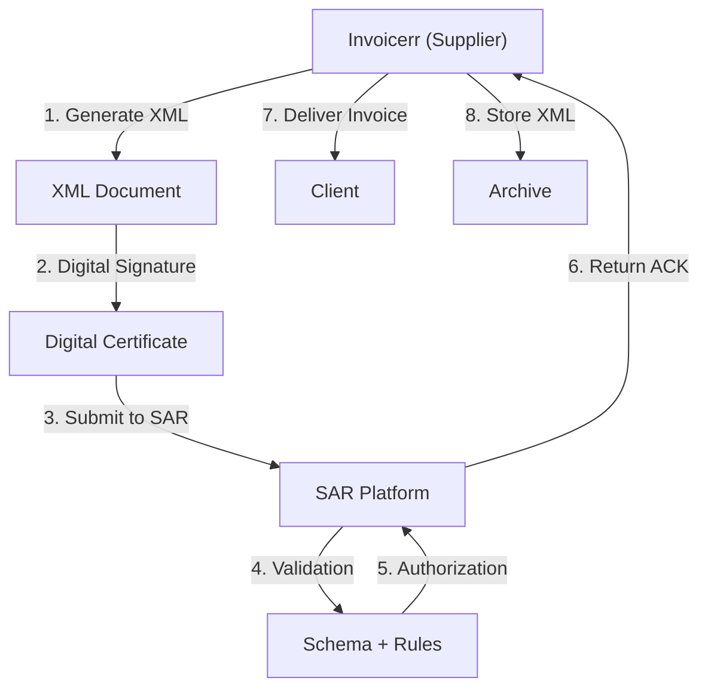

# 🇭🇳 Honduras - E-Invoicing Specifications (Factura Electrónica)

**Status:** 🟢 **Mandatory** | Active for all businesses
**Authority:** SAR (Servicio de Administración de Rentas)
**Platform:** SAR Electronic Invoice System

---

## 1. Context & Overview

Honduras has mandatory e-invoicing (factura electrónica) through SAR. The system follows a **Clearance Model** requiring pre-authorization. Progressive rollout began in 2018.

| Date | Scope | Obligation |
| --- | --- | --- |
| **2018+** | Progressive | Initial rollout by sector |
| **Ongoing** | All businesses | Continuous SAR authorization |
| **Current** | Full mandatory | All transaction types |

---

## 2. Technical Workflow (Clearance)

### 🧱 Key Components

1. **RTN (Registro Tributario Nacional):** Tax ID
2. **Digital Certificate:** SAR-approved
3. **Sequential Numbering:** Required

---

## 3. Data Standards & Formats

### A. Required Format

- **XML Format:** SAR national schema
- **Encoding:** UTF-8
- **Digital Signature:** Required

### B. Document Types

| Code | Type | Description |
| --- | --- | --- |
| **01** | Factura | Invoice |
| **03** | Nota Débito | Debit note |
| **04** | Nota Crédito | Credit note |
| **05** | Comprobante de Retención | Withholding |

### C. Critical Data Fields

- **RTN:** Tax ID (14 digits)
- **ISV:** VAT (15%)
- **Número Autorización:** Authorization number

---

## 4. Business Model & Compliance

### A. Workflow

1. **RTN Registration:** Obtain Honduran tax ID
2. **Certificate:** Acquire SAR digital certificate
3. **XML Generation:** Create schema-compliant document
4. **Signing:** Apply electronic signature
5. **Submission:** Send to SAR
6. **Delivery:** Send to buyer

### B. Archiving

- **Retention:** 5 years
- **Format:** Original XML

---

## 5. Implementation Checklist

- [ ] **RTN Registration:** Obtain Honduran tax ID
- [ ] **Digital Certificate:** Acquire SAR certificate
- [ ] **XML Engine:** Build SAR schema generator
- [ ] **Signature Integration:** Implement signing
- [ ] **SAR API:** Connect to web services

---

## 6. Resources

- **SAR Portal:** [Sar.gob.hn](https://www.sar.gob.hn)
