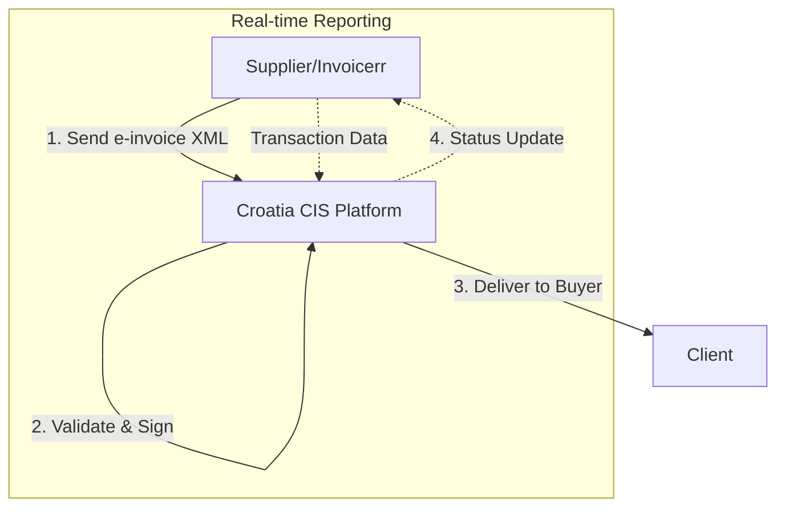

# 🇭🇷 Croatia - E-Invoicing Specifications (Fiscalization 2.0)

**Status:** 🟢 **Mandatory** | Active since January 1, 2026
**Authority:** Tax Administration (Porezna uprava)
**Platform:** Central Information System (CIS) / e-Račun

---

## 1. Context & Overview

Croatia implemented mandatory e-invoicing under the "Fiscalization 2.0" reform. The law was passed in mid-2025 with one of the shortest implementation timelines in Europe - just 6 months. The mandate covers B2B, B2C, and B2G transactions.

| Date | Scope | Obligation |
| --- | --- | --- |
| **January 1, 2026** | B2G + Large enterprises | Mandatory e-invoicing |
| **January 1, 2027** | All businesses | Full mandatory e-invoicing |

---

## 2. Technical Workflow

### Key Components

1. **CIS (Central Information System)** - Government platform for e-invoice validation and delivery
2. **e-Račun Portal** - Web interface for invoice management
3. **Fiscalization 2.0** - Real-time transaction reporting

---

## 3. Data Standards & Formats

### Format Requirements
- **EN 16931** standard compliant XML
- UBL 2.1 syntax
- National XML schema (e-Račun format)

### Mandatory Fields
- Supplier and buyer OIB (Croatian tax ID)
- Invoice number (sequential)
- Date and time of issue
- Description of goods/services
- VAT rates and amounts
- Total amounts

---

## 4. Implementation Timeline

| Phase | Date | Scope |
| --- | --- | --- |
| Phase 1 | January 1, 2026 | B2G + Large enterprises (over 40M HRK revenue) |
| Phase 2 | January 1, 2027 | All businesses |

### Technical Issues
The launch faced challenges with complex invoices (10+ line items) and data access issues in early January 2026.

---

## 5. Business Model

- **Clearance Model:** All invoices must be validated by CIS before delivery
- **Real-time reporting:** Transaction data must be transmitted to tax authority
- **QR Code:** Each invoice receives a unique QR code for validation

---

## 6. Implementation Checklist

- [ ] Register with CIS/e-Račun portal
- [ ] Implement EN 16931 XML format generation
- [ ] Set up API connection to CIS
- [ ] Configure digital signature (if required)
- [ ] Update invoice workflows for real-time submission
- [ ] Test with sandbox environment
- [ ] Train staff on new processes

---

## 7. Resources

- **Tax Administration:** [Porezna-uprava.hr](https://www.porezna-uprava.hr)
- **e-Račun Portal:** [Eraacun.hr](https://www.eraacun.hr)
- **Official Ordinance:** [Ministarstvo financija](https://mfin.gov.hr)
