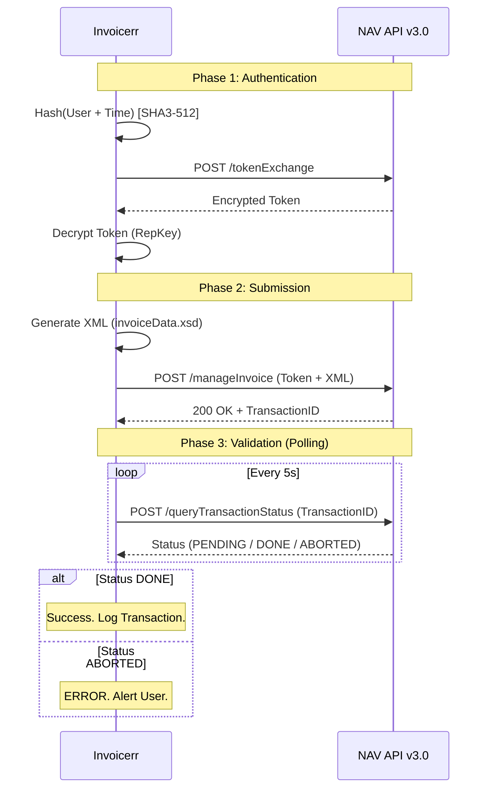

# 🇭🇺 Hungary - Invoicing Specifications (Online Számla / RTIR)

**Status:** 🔴 **Mandatory Reporting (RTIR)** | 🟡 **Mandatory E-Invoicing (Energy/Water)**
**Authority:** NAV (Nemzeti Adó- és Vámhivatal)
**Platform:** **Online Számla** (Real-Time Invoice Reporting)

---

## 1. Context & Roadmap

Hungary operates a strict **Real-Time Invoice Reporting (RTIR)** system.
**Crucial Distinction:**

* **Reporting:** You issue the invoice to the client (PDF/Paper) and *simultaneously* report data to NAV.
* **E-Invoicing:** For Energy/Water utility sectors (since 2025/2026), the reported XML *is* the legal invoice.

| Date | Scope | Obligation |
| --- | --- | --- |
| **Current** | **Reporting** | Mandatory for **ALL** invoices (B2B, B2C, Export) issued by Hungarian taxpayers. |
| **Jan 2026** | **E-Invoicing** | Mandatory for **Water & Energy** utility sectors (B2B). |
| **Future** | **ViDA** | Alignment with EU ViDA proposal (likely ~2030). |

---

## 2. Technical Workflow (Async Reporting)

The API is **Asynchronous**. You send data, get a token, and must poll for the result.

### 🧱 Key Components

1. **Technical User:** Not a human login. Requires `XML Signing Key` and `XML Replacement Key`.
2. **Token Exchange:** Challenge-response auth mechanism preventing replay attacks.
3. **Completeness Indicator:**
* `false`: Just a report. Legal invoice is PDF/Paper.
* `true`: This XML *is* the legal invoice (E-Invoicing).

---

## 3. Data Standards & Formats

* **Format:** `NAV XML v3.0`. Proprietary standard (not UBL/CII), but semantically similar to EN 16931.
* **Hashing:** **SHA3-512** is recommended for signatures.

### ⚠️ Critical Data Fields

* **Tax Codes:** Strictly enforced. VAT Exempt items must cite the legal reference.
* **Currency:** If invoicing in EUR/USD, **VAT amount must be reported in HUF** using the valid exchange rate.
* **Line Classification:** Use `IncomeClassification` codes (e.g., Sales of Goods vs Services).

---

## 4. Security & Cryptography

Hungary uses advanced crypto. SSL is not enough.

* **Request Signature:** Each API call header must include a signature: `Hash(RequestId + Timestamp + Key)`.
* **Password Hashing:** Passwords are never sent. You send a partial hash.
* **Algorithm:** `SHA-512` or `SHA3-512`.

---

## 5. Implementation Checklist

* [ ] **Crypto Engine:** Implement **SHA3-512** hashing and AES decryption (for the Token).
* [ ] **Async Polling:** Build a background job that checks `queryTransactionStatus` until `DONE`. Do not block the UI.
* [ ] **HUF Converter:** If the invoice is in FX, force the user to input the HUF Exchange Rate (or fetch from MNB).
* [ ] **Error Handling:** Map `ABORTED` responses to user-friendly errors. (e.g., "Invalid Tax Code").
* [ ] **Retry Logic:** If NAV is down (500), queue the report. You have **24h** to recover and report.

---

## 6. Resources

* **Portal:** [Online Számla](https://onlineszamla.nav.gov.hu/)
* **API Specs:** [GitHub - NAV-Ado/InterfaceSpec](https://www.google.com/search?q=https://github.com/nav-gov-hu/Online-Invoice-System-3.0)
* **Dev Portal:** [Developer Documentation](https://onlineszamla.nav.gov.hu/dokumentaciok)