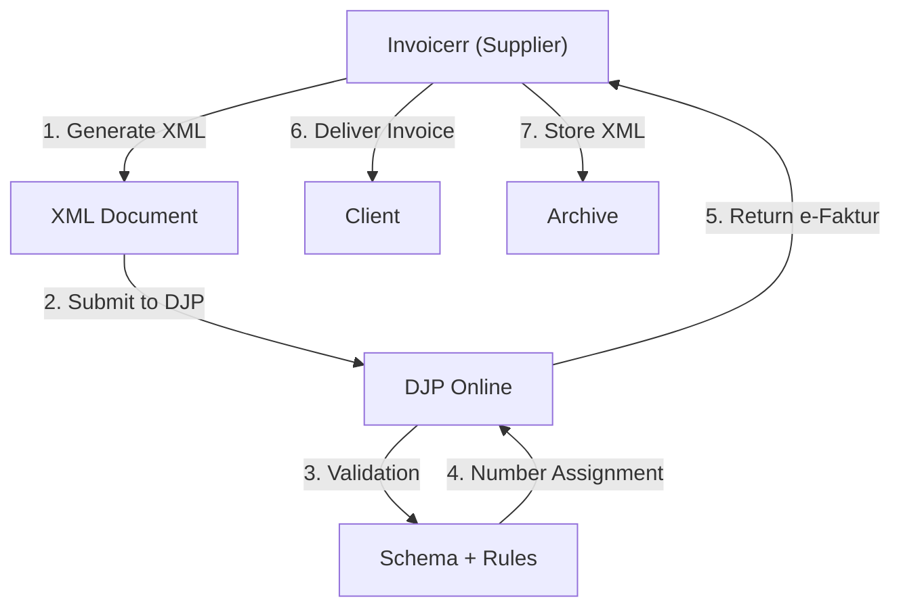

# 🇮🇩 Indonesia - E-Invoicing Specifications (e-Faktur)

**Status:** 🟢 **Mandatory** | Active for all VAT taxpayers
**Authority:** DGT (Directorate General of Taxes)
**Platform:** e-Faktur (Electronic Tax Invoice System)

---

## 1. Context & Overview

Indonesia has mandatory e-invoicing through the e-Faktur system. All VAT-registered businesses must issue electronic tax invoices through the DGT platform. Progressive rollout completed in 2020 for all VAT taxpayers.

| Date | Scope | Obligation |
| --- | --- | --- |
| **2015+** | Large taxpayers | Progressive mandatory rollout |
| **2020+** | All VAT taxpayers | Full mandatory e-faktur |
| **Ongoing** | All businesses | Continuous DGT compliance |

---

## 2. Technical Workflow (Clearance Model)

### 🧱 Key Components

1. **NPWP (Nomor Pokok Wajib Pajak):** Tax ID (15 digits)
2. **e-Faktur Format:** DGT XML schema
3. **Digital Signature:** Required
4. **Pre-populated Data:** Master data from DGT

---

## 3. Data Standards & Formats

### A. Required Format

- **XML Format:** DGT e-Faktur schema
- **Encoding:** UTF-8
- **Digital Signature:** Required

### B. Document Types

| Type | Description |
| --- | --- |
| **Faktur Pajak (Tax Invoice)** | Standard VAT invoice |
| **Faktur Penjualan (Sales)** | Sales document |
| **Retur (Return)** | VAT return |

### C. Critical Data Fields

- **NPWP:** Tax ID (15 digits)
- **VAT Rate:** 11% standard
- **NPWP Buyer:** Required for B2B
- **Serial Number:** Unique identifier

---

## 4. Business Model & Compliance

### A. Workflow

1. **NPWP Registration:** Obtain Indonesian tax ID
2. **Software Certification:** Get e-Faktur certification
3. **XML Generation:** Create e-Faktur document
4. **Submission:** Send to DJP Online
5. **Delivery:** Send to buyer

### B. Archiving

- **Retention:** 10 years
- **Format:** Original XML

---

## 5. Implementation Checklist

- [ ] **NPWP Registration:** Obtain Indonesian tax ID
- [ ] **Certification:** Get e-Faktur software approval
- [ ] **XML Engine:** Build DGT schema generator
- [ ] **DJP API:** Connect to e-Faktur system
- [ ] **Document Types:** Support all invoice types

---

## 6. Resources

- **DGT Portal:** [Pajak.go.id](https://www.pajak.go.id)
- **e-Faktur Portal:** [Efaktur.pajak.go.id](https://efaktur.pajak.go.id)
