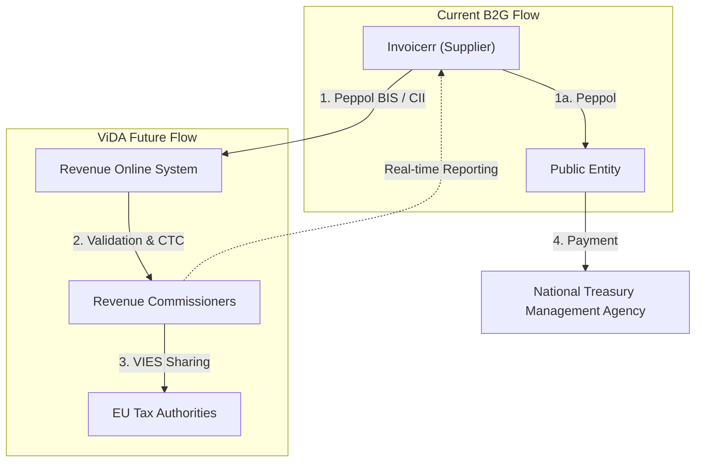

# 🇮🇪 Ireland - E-Invoicing Specifications

**Status:** 🟢 **B2G Active** | 🟡 **ViDA Phased 2028-2030**
**Authority:** Revenue Commissioners (RC)
**Platform:** Peppol / Revenue Online System

---

## 1. Context & Overview

Ireland has mandatory B2G e-invoicing under EU Directive 2014/55/EU. B2B e-invoicing is voluntary but Revenue announced a phased ViDA implementation plan in October 2025.

| Date | Scope | Obligation |
| --- | --- | --- |
| **Apr 2019** | B2G Central | Public bodies must receive e-invoices |
| **Apr 2020** | B2G All | All public entities must receive e-invoices |
| **Nov 2028** | Large Corps | Mandatory e-invoicing for large VAT entities (B2B) |
| **Nov 2029** | Cross-border Traders | All VAT entities in cross-border B2B |
| **Jul 2030** | All B2B | Full mandatory B2B e-invoicing |
| **Nov 2028** | Receiving | All businesses must be able to receive e-invoices |

---

## 2. Technical Workflow

### 🧱 Key Components

1. **Revenue Online System (ROS):** Tax authority digital platform
2. **Peppol Network:** E-invoice delivery infrastructure
3. **VIES Integration:** EU-wide VAT information exchange

---

## 3. Data Standards & Formats

### A. Accepted Formats

* **EN 16931** compliant XML
* **Peppol BIS Billing 3.0**
* **UBL 2.1** syntax
* **UN/CEFACT CII** format

### B. Critical Data Fields

* **VAT Number:** Irish VAT registration
* **TIN:** Tax reference number
* **CRO Number:** Companies Registration Office number

---

## 4. Business Model

* **B2G Post-Audit:** Invoice delivery via Peppol
* **ViDA CTC:** Future real-time reporting to Revenue
* **VIES Sharing:** Cross-border data exchange with EU

---

## 5. Implementation Checklist

* [ ] **Peppol Access:** Obtain Peppol participant identifier
* [ ] **ROS Registration:** Register with Revenue Online System
* [ ] **EN 16931 Compliance:** Implement structured XML format
* [ ] **ViDA Readiness:** Prepare for 2028-2030 phased mandate
* [ ] **Archive Setup:** Configure 6-year invoice storage

---

## 6. Resources

* **Revenue Commissioners:** [Revenue.ie](https://www.revenue.ie)
* **ROS Portal:** [Ros.ie](https://www.ros.ie)
* **EU ViDA:** [ec.europa.eu/vida](https://ec.europa.eu)
