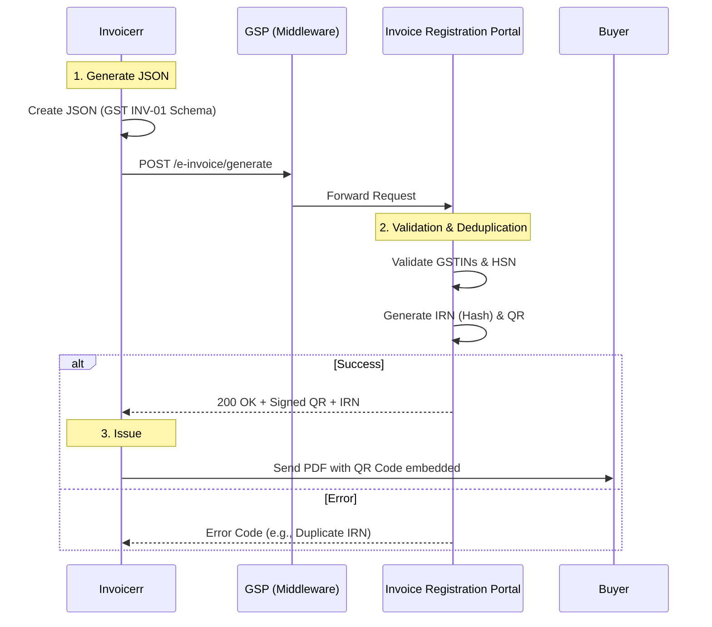

# 🇮🇳 India - Invoicing Specifications (GST e-Invoice / IRP)

**Status:** 🔴 **Mandatory Clearance** (For turnover > ₹5 Cr)
**Authority:** GSTN (Goods and Services Tax Network) / NIC
**System:** **IRP** (Invoice Registration Portal)

---

## 1. Context & Roadmap

India uses a strict **Clearance** model. You cannot issue a legal invoice to the buyer until it has been "registered" with the IRP and assigned an IRN.
**Crucial Rule:** The IRN and Signed QR Code are the proof of validity.

| Date | Scope | Obligation |
| :--- | :--- | :--- |
| **Active** | **> ₹5 Crores** | Mandatory for businesses with turnover > ₹5 Cr. |
| **Pending** | **> ₹2 Crores** | Expected lowering of threshold. |
| **Active** | **B2B / Export** | Mandatory. B2C is exempt from IRP but large businesses need dynamic QR. |
| **New (2025)** | **30 Days Rule** | Invoices must be reported within 30 days of issuance (for > ₹10 Cr turnover). |

---

## 2. Technical Workflow (IRP Registration)

Invoicerr must connect to a **GSP** (GST Suvidha Provider) to reach the IRP. Direct connection is rare.

### 🧱 Key Components

1. **IRN (Invoice Reference Number):** A unique 64-char hash.
2. **Signed QR Code:** Returned by the IRP. Contains the IRN and digital signature. **Must be printed on the PDF.**
3. **GSP (GST Suvidha Provider):** Licensed intermediary (e.g., ClearTax, Masters India) that provides the API tunnel.

---

## 3. Data Standards & Requirements

### A. Format: `GST INV-01` (JSON)

* **Syntax:** Specific JSON schema.
* **Constraints:**
* **HSN Codes:** Minimum 6 digits required.
* **Tax Rates:** Must match valid GST slabs (0, 5, 12, 18, 28).

### B. Business Rules

* **Supply Type:** `B2B`, `SEZWP` (SEZ with payment), `SEZWOP` (SEZ without payment), `EXPWP` (Export with payment), `EXPWOP` (Export without payment).
* **Distance:** Mandatory for E-Way Bill generation (often auto-calculated by PIN code).

---

## 4. E-Way Bill Integration

If the invoice value > ₹50,000 and involves goods movement, Invoicerr can generate the **E-Way Bill** simultaneously by passing `TransporterId` and `Distance` in the e-invoice payload.

---

## 5. Implementation Checklist

* [ ] **GSP Partnership:** Sign up with a GSP to get API credentials.
* [ ] **JSON Engine:** Map internal data to the GST JSON schema.
* [ ] **QR Code Renderer:** The API returns the QR data as a string. You must render this as a visual QR code on the PDF.
* [ ] **HSN Validator:** Ensure products have valid HSN codes.
* [ ] **Export Logic:** If `SupplyType` = `EXP...`, ensure Port Code and Country Code are handled.

---

## 6. Resources

* **Portal:** [Portail E-Invoice](https://einvoice1.gst.gov.in/)
* **API Sandbox:** [E-Invoice API Sandbox](https://einv-apisandbox.nic.in/)
* **Schema:** [JSON Schema](https://einv-apisandbox.nic.in/api-schema-list.html)
