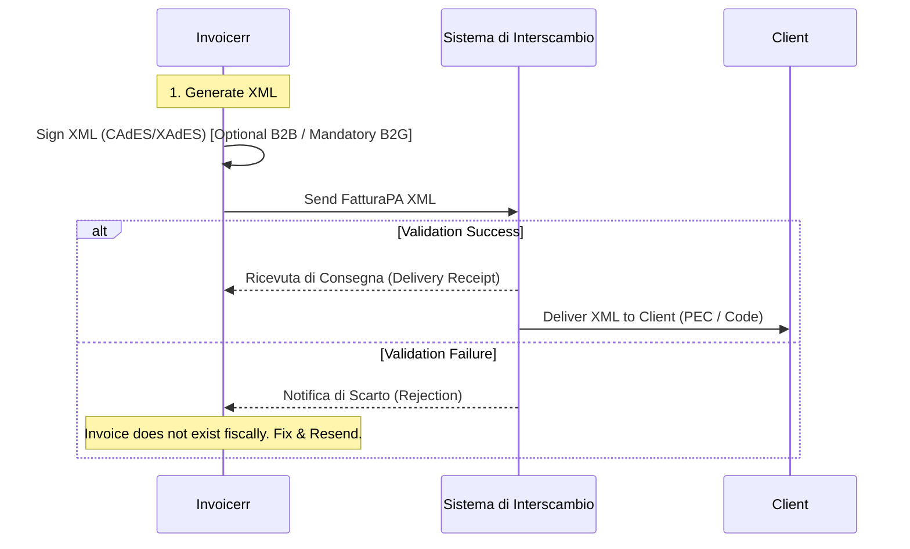

# 🇮🇹 Italy - Invoicing Specifications (Sistema di Interscambio)

**Status:** 🔴 **Fully Mandatory** (B2G, B2B, B2C)
**Authority:** AdE (Agenzia delle Entrate)
**Platform:** **SdI** (Sistema di Interscambio)

---

## 1. Context & Roadmap

Italy is the pioneer of the **Clearance Model** in Europe. The system is mature, stable, and strictly enforced.
**Key 2026 Update:** The new VAT Code (*Testo Unico IVA*) consolidates regulations, and integration between POS terminals and tax registers is now mandatory for retail.

| Date | Scope | Obligation |
| --- | --- | --- |
| **Active** | **B2B / B2G** | Mandatory e-invoicing for all domestic invoices via SdI. |
| **Active** | **Cross-Border** | "Esterometro" abolished. Foreign invoices must be reported via SdI (TD17/18/19). |
| **Active** | **B2C** | Mandatory issuance (even if the consumer just gets a PDF copy). |

---

## 2. Technical Workflow (Clearance)

The SdI acts as a "postman" and "validator". You do not send the invoice to the client; you send it to SdI.

### 🧱 Key Components

1. **FatturaPA (XML):** The only legal format.
2. **SdI (The Hub):** Validates Tax IDs, calculations, and delivers the file.
3. **Codice Destinatario:** The routing code (7 chars) to identify the recipient's software channel.

---

## 3. Data Standards & Document Types

### A. Document Types (`TipoDocumento`)

Invoicerr must allow the user to select the correct type. Using `TD01` for everything is illegal.

* `TD01`: Standard Invoice.
* `TD04`: Credit Note.
* `TD07`: Simplified Invoice.
* **`TD17`:** Self-invoice for purchasing **Services** from abroad (Reverse Charge).
* **`TD18`:** Self-invoice for purchasing **Goods** from EU (Intra-community).
* **`TD19`:** Self-invoice for domestic Reverse Charge (e.g., Subcontracting).
* **`TD29`:** (New 2026) Self-invoice to regularize a missing supplier invoice.

### B. Tax Nature Codes (`Natura`)

If VAT is 0%, a specific code is mandatory:

* `N2.1`: Not subject to VAT (e.g., Lacking territoriality).
* `N3.1`: Export (Non-taxable).
* `N3.2`: Intra-community supply.
* `N6.x`: Reverse Charge (e.g., `N6.3` Subcontracting).

---

## 4. Transmission Channels

Invoicerr can connect to SdI via:

1. **SdICoop (Web Service):** The professional A2A method (SOAP/REST). Requires accreditation.
2. **PEC (Certified Email):** For low volumes. Send XML to `sdi01@pec.fatturapa.it`.
3. **Intermediary:** Most SaaS tools connect via a certified "Intermediario" (Provider) to avoid handling the raw SOAP complexity.

---

## 5. Implementation Checklist

* [ ] **XML Engine:** Generate `FatturaPA` XML (v1.8/1.9).
* [ ] **Routing Logic:**
* If Client has `Codice Destinatario` (7 chars) -> Use it.
* If Client uses PEC -> Use `0000000` as Code + Fill `PECDestinatario`.
* If Foreign Client -> Use `XXXXXXX` as Code + Fill Country ID.

* [ ] **Type Selector:** Add a dropdown for `TipoDocumento` (TD01, TD04, etc.).
* [ ] **Reverse Charge:** If user selects a Reverse Charge tax rate, force selection of `Natura` code (N6.x).
* [ ] **Error Handling:** Handle `Notifica di Scarto`. The invoice must be flagged as "Rejected" in the UI so the user can fix and re-emit (using the **same** number is allowed if corrected within 5 days).

---

## 6. Resources

* **Official Portal:** [Fatture e Corrispettivi](https://ivaservizi.agenziaentrate.gov.it/portale/)
* **Technical Specs:** [FatturaPA Documentation](https://www.fatturapa.gov.it/it/norme-e-regole/documentazione-fattura-elettronica/)
* **Simulator:** [SdI Simulator](https://sdi.fatturapa.gov.it/SdI2FatturaPAWeb/AccediAlServizioAction.do?pagina=controlla_fattura)