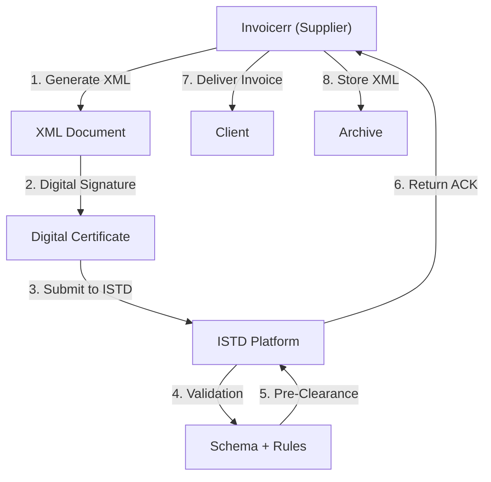

# 🇯🇴 Jordan - E-Invoicing Specifications (ISTD e-Invoice)

**Status:** 🟢 **Mandatory** | Active for all businesses
**Authority:** ISTD (Income and Sales Tax Department)
**Platform:** e-Invoice System (GST)

---

## 1. Context & Overview

Jordan has implemented mandatory e-invoicing through the ISTD. All businesses must issue electronic invoices for GST/VAT purposes.

| Date | Scope | Obligation |
| --- | --- | --- |
| **2018+** | Progressive | Initial mandatory rollout |
| **Ongoing** | All businesses | Continuous reporting |

---

## 2. Technical Workflow (Clearance Model)

### 🧱 Key Components

1. **Tax Registration:** Required
2. **Digital Certificate:** ISTD-approved
3. **GST Integration:** Required

---

## 3. Data Standards & Formats

### A. Required Format

- **XML Format:** ISTD schema
- **Encoding:** UTF-8
- **Digital Signature:** Required

### B. Document Types

| Type | Description |
| --- | --- |
| **Tax Invoice** | Standard GST invoice |
| **Credit/Debit Note** | Adjustments |

### C. Critical Data Fields

- **Tax ID:** Registration number
- **Invoice Number:** Unique identifier
- **GST Rate:** 16% standard

---

## 4. Business Model & Compliance

### A. Workflow

1. **Tax Registration:** Obtain Jordanian tax ID
2. **Certificate:** Acquire ISTD digital certificate
3. **XML Generation:** Create compliant document
4. **Signing:** Apply electronic signature
5. **Submission:** Send to ISTD
6. **Delivery:** Send to buyer

### B. Archiving

- **Retention:** 6 years
- **Format:** Original XML

---

## 5. Implementation Checklist

- [ ] **Tax Registration:** Obtain Jordanian tax ID
- [ ] **Digital Certificate:** Acquire ISTD certificate
- [ ] **XML Engine:** Build ISTD schema generator
- [ ] **Signature Integration:** Implement signing
- [ ] **ISTD API:** Connect to platform

---

## 6. Resources

- **ISTD Portal:** [Istd.gov.jo](https://www.istd.gov.jo)
