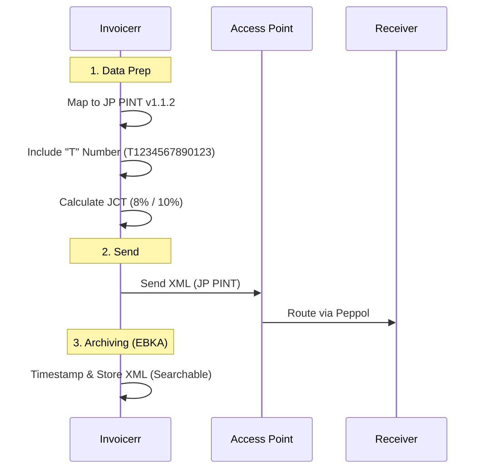

# 🇯🇵 Japan - Invoicing Specifications (JP PINT / QIS)

**Status:** 🟡 **Voluntary B2B** (Strong incentives) | 🔴 **Mandatory Archiving (EBKA)**
**Authority:** Digital Agency (E-Invoice) / NTA (Tax)
**Standard:** **Peppol JP PINT v1.1.2**

---

## 1. Context & Roadmap

Japan is modernizing its invoice system through the **Qualified Invoice System (QIS)**.
**Crucial Distinction:**

* **QIS:** To deduct VAT (JCT), the buyer **must** receive a "Qualified Invoice" with a Tax Registration Number ("T" number).
* **Peppol:** The standard method to exchange these QIS invoices electronically.
* **EBKA:** Strict law on **archiving**. You cannot print electronic invoices for storage; they must remain digital.

| Date | Scope | Obligation |
| --- | --- | --- |
| **Active** | **QIS** | Only invoices with "T" numbers allow full tax deduction. |
| **Active** | **EBKA** | Mandatory digital archiving for e-transactions. No paper fallback. |
| **Jan 9, 2026** | **JP PINT** | Update to version 1.1.2 mandated for Peppol users. |

---

## 2. Technical Workflow (Peppol 4-Corner)

Japan uses the **Peppol Network**. There is no central government clearance platform.

### 🧱 Key Components

1. **JP PINT:** The Japanese Peppol specification. Handles JCT (consumption tax) logic.
2. **"T" Number:** The Qualified Invoice Issuer number. Format: `T` + 13 digits.
3. **EBKA Archiving:** Invoicerr must store the issued XML. The archive must be **searchable** by Date, Amount, and Client.

---

## 3. Data Standards & Identifiers

### A. Identifiers

* **Tax ID:** `T` + 13 digits.
* **Peppol ID:** Usually the same, scheme `0188`. Example: `0188:T1234567890123`.

### B. Critical Fields (QIS)

* **Tax Breakdown:** Must separate 10% (Standard) and 8% (Reduced).
* **Rounding:** Strict rules on rounding tax amounts (only once per invoice/tax rate, not per line).

---

## 4. Implementation Checklist

* [ ] **Peppol Engine:** Implement **JP PINT v1.1.2**.
* [ ] **T-Number Field:** Add a mandatory field for the issuer's "T" number in the settings.
* [ ] **EBKA Search:** Ensure your "Invoices Sent" list allows filtering by Date Range, Amount Range, and Client Name (Legal requirement for storage).
* [ ] **JCT Calculation:** Implement logic to handle 8% and 10% JCT with correct rounding.

---

## 5. Resources

* **Digital Agency:** [E-Invoice Promotion](https://www.google.com/search?q=https://www.digital.go.jp/policies/posts/e-invoice)
* **EIPA:** [E-Invoice Promotion Association](https://www.eipa.jp/)
* **Peppol Directory:** [Directory Lookup](https://directory.peppol.eu)