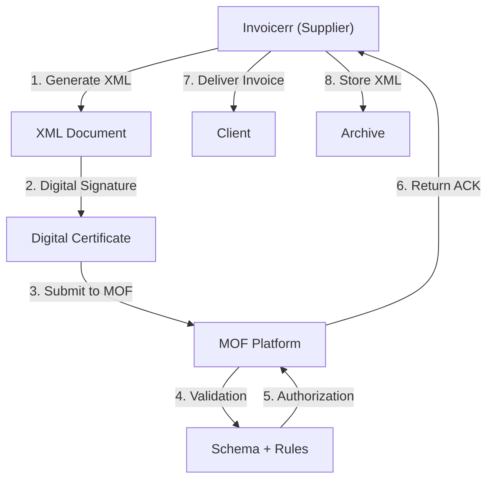

# 🇰🇼 Kuwait - E-Invoicing Specifications (MOF e-Invoice)

**Status:** 🟢 **Mandatory** | Active for all businesses
**Authority:** MOF (Ministry of Finance)
**Platform:** e-Invoice System

---

## 1. Context & Overview

Kuwait has implemented mandatory e-invoicing through the Ministry of Finance. All businesses must use electronic invoicing systems for tax compliance.

| Date | Scope | Obligation |
| --- | --- | --- |
| **Ongoing** | All businesses | Mandatory e-invoicing |

---

## 2. Technical Workflow (Clearance Model)

### 🧱 Key Components

1. **TIN:** Tax ID
2. **Digital Certificate:** MOF-approved
3. **MOF Certification:** Required

---

## 3. Data Standards & Formats

### A. Required Format

- **XML Format:** MOF schema
- **Encoding:** UTF-8
- **Digital Signature:** Required

### B. Document Types

| Type | Description |
| --- | --- |
| **Tax Invoice** | Standard VAT invoice |
| **Simplified Invoice** | B2C |

### C. Critical Data Fields

- **TIN:** Tax ID
- **VAT Rate:** 0% / 5%
- **Invoice Number:** Unique identifier

---

## 4. Business Model & Compliance

### A. Workflow

1. **Tax Registration:** Obtain Kuwaiti tax ID
2. **Certificate:** Acquire MOF certificate
3. **XML Generation:** Create compliant document
4. **Signing:** Apply electronic signature
5. **Submission:** Send to MOF
6. **Delivery:** Send to buyer

### B. Archiving

- **Retention:** 6 years
- **Format:** Original XML

---

## 5. Implementation Checklist

- [ ] **Tax Registration:** Obtain Kuwaiti tax ID
- [ ] **Digital Certificate:** Acquire MOF certificate
- [ ] **XML Engine:** Build MOF schema generator
- [ ] **Signature Integration:** Implement signing
- [ ] **MOF API:** Connect to platform

---

## 6. Resources

- **MOF Portal:** [Moh.gov.kw](https://www.moh.gov.kw)
