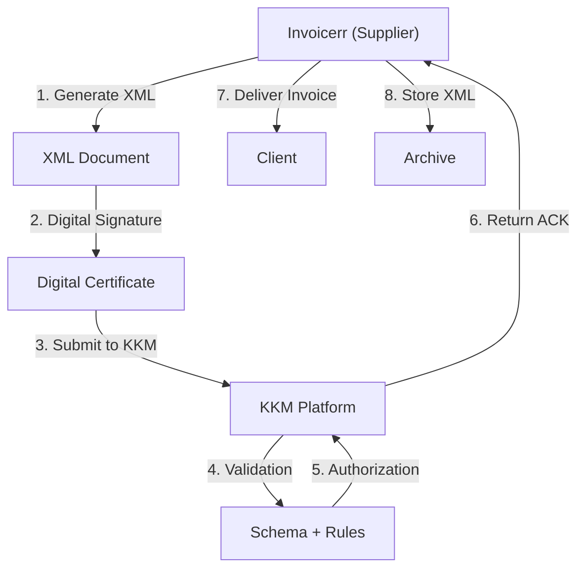

# 🇰🇿 Kazakhstan - E-Invoicing Specifications (KKM e-Invoice)

**Status:** 🟢 **Mandatory** | Active for all businesses
**Authority:** KKM (Committee for Treasury)
**Platform:** KKM Electronic System

---

## 1. Context & Overview

Kazakhstan has mandatory e-invoicing through the KKM system. All businesses must issue electronic invoices authorized by the treasury committee.

| Date | Scope | Obligation |
| --- | --- | --- |
| **Ongoing** | All businesses | Mandatory e-invoicing |

---

## 2. Technical Workflow (Clearance Model)

### 🧱 Key Components

1. **BIN (Business Identification Number):** Required
2. **Digital Certificate:** KKM-approved
3. **Budget Integration:** Required

---

## 3. Data Standards & Formats

### A. Required Format

- **XML Format:** KKM schema
- **Encoding:** UTF-8
- **Digital Signature:** Required

### B. Document Types

| Type | Description |
| --- | --- |
| **Tax Invoice** | Standard invoice |
| **Adjustment Note** | Credit/Debit |

### C. Critical Data Fields

- **BIN:** Business ID (12 digits)
- **Invoice Number:** Unique identifier
- **VAT Rate:** 12% standard

---

## 4. Business Model & Compliance

### A. Workflow

1. **BIN Registration:** Obtain Kazakh business ID
2. **Certificate:** Acquire KKM digital certificate
3. **XML Generation:** Create compliant document
4. **Signing:** Apply electronic signature
5. **Submission:** Send to KKM
6. **Delivery:** Send to buyer

### B. Archiving

- **Retention:** 5 years
- **Format:** Original XML

---

## 5. Implementation Checklist

- [ ] **BIN Registration:** Obtain Kazakh business ID
- [ ] **Digital Certificate:** Acquire KKM certificate
- [ ] **XML Engine:** Build KKM schema generator
- [ ] **Signature Integration:** Implement signing
- [ ] **KKM API:** Connect to platform

---

## 6. Resources

- **KKM Portal:** [Kkm.gov.kz](https://www.kkm.gov.kz)
