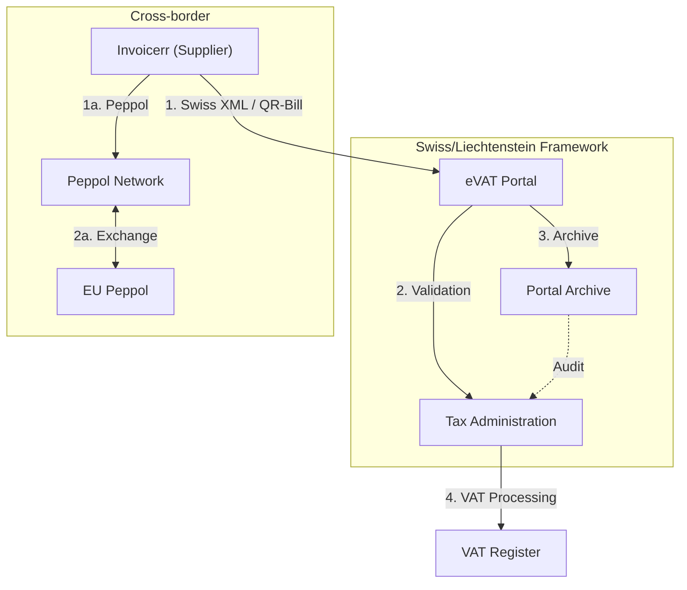

# 🇱🇮 Liechtenstein - E-Invoicing Specifications

**Status:** 🟢 **Follows Switzerland** | 🟢 **eVAT Portal 2025**
**Authority:** Tax Administration (Steuerverwaltung)
**Platform:** Swiss E-Invoicing Framework / eVAT Portal

---

## 1. Context & Overview

Liechtenstein follows Switzerland's e-invoicing regulations due to customs and monetary union. From January 2025, all VAT transactions must be processed through the new eVAT portal.

| Date | Scope | Obligation |
| --- | --- | --- |
| **Ongoing** | B2G/B2B | Follows Swiss e-invoicing framework |
| **Jan 1, 2025** | All VAT | Mandatory eVAT portal for all VAT transactions |
| **Jul 2030** | Cross-border | ViDA mandatory for intra-EU B2B |

---

## 2. Technical Workflow

### 🧱 Key Components

1. **eVAT Portal:** New mandatory VAT transaction platform (Jan 2025)
2. **Swiss E-Invoicing Framework:** Based on Swiss standards
3. **Peppol Network:** Cross-border interoperability

---

## 3. Data Standards & Formats

### A. Accepted Formats

* **Swiss QR-bill** format
* **Swiss XML** standard
* **UBL 2.1** syntax (cross-border)
* **EN 16931** compliant (ViDA future)

### B. Critical Data Fields

* **LI-UID:** Liechtenstein VAT number
* **eID.li:** Electronic identification
* **eRepresentation:** VAT authorization management

---

## 4. Business Model

* **Post-Audit Model:** Based on Swiss framework
* **eVAT Mandatory:** All VAT transactions via portal from 2025
* **Swiss Integration:** Full alignment with Swiss tax system

---

## 5. Implementation Checklist

* [ ] **eVAT Registration:** Register and activate eVAT portal access
* [ ] **eID.li Setup:** Obtain electronic identification
* [ ] **eRepresentation:** Set up VAT authorization management
* [ ] **Swiss Compliance:** Align with Swiss e-invoicing standards
* [ ] **Archive Setup:** Configure 10-year storage (movable property)

---

## 6. Resources

* **Tax Administration:** [Steuerverwaltung.li](https://www.steuerverwaltung.li)
* **eVAT Portal:** [Evat.portal.li](https://evat.portal.li)
* **Swiss Tax Administration:** [Estv.admin.ch](https://www.estv.admin.ch)
