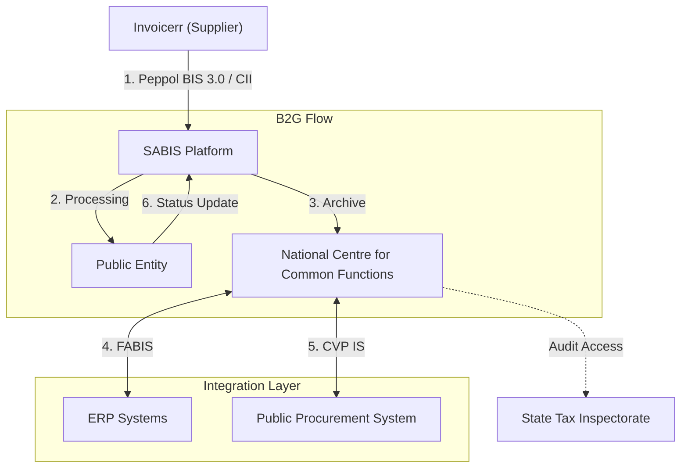

# 🇱🇹 Lithuania - E-Invoicing Specifications

**Status:** 🟢 **B2G Active** | 🔴 **B2B Voluntary** | 🟡 **ViDA 2030**
**Authority:** State Tax Inspectorate (VMI)
**Platform:** SABIS (replaced eSąskaita)

---

## 1. Context & Overview

Lithuania has mandatory B2G e-invoicing via the SABIS platform since September 2024 (replacing eSąskaita). B2B e-invoicing is voluntary but growing. The country is preparing for ViDA 2030 requirements.

| Date | Scope | Obligation |
| --- | --- | --- |
| **Jul 1, 2024** | B2G Transition | Migration from eSąskaita to SABIS begins |
| **Sep 1, 2024** | B2G Mandatory | SABIS full mandatory for all B2G |
| **Jan 1, 2025** | Verbal Contracts | SABIS mandatory for verbal contracts > €1000 |
| **2030** | B2B ViDA | Mandatory e-invoicing under ViDA directive |

---

## 2. Technical Workflow

### 🧱 Key Components

1. **SABIS:** General Account Administration Information System
2. **NBFC:** National Centre for Common Functions (operator)
3. **Peppol Integration:** International interoperability

---

## 3. Data Standards & Formats

### A. Accepted Formats

* **Peppol BIS Billing 3.0** (mandatory for B2G)
* **Peppol BIS Billing CII Invoice**
* **UBL 2.1** syntax

### B. Critical Data Fields

* **PVM mokėtojo kodas:** Lithuanian VAT ID
* **Company Code:** Registration number
* **SABIS Account:** Platform identifier

---

## 4. Business Model

* **B2G Clearance:** Invoice validation through SABIS
* **B2B Post-Audit:** Voluntary, no clearance required
* **Digital Archive:** 10-year storage via SABIS

---

## 5. Implementation Checklist

* [ ] **SABIS Registration:** Register for SABIS platform access
* [ ] **Peppol Setup:** Obtain Peppol access point
* [ ] **Peppol BIS 3.0:** Implement mandatory format
* [ ] **ERP Integration:** Connect to FABIS/DBSIS systems
* [ ] **Archive Configuration:** Set up 10-year storage

---

## 6. Resources

* **State Tax Inspectorate:** [Vmi.lt](https://www.vmi.lt)
* **SABIS Portal:** [Sabis.lt](https://www.sabis.lt)
* **NBFC:** [Nfis.lt](https://www.nfis.lt)
