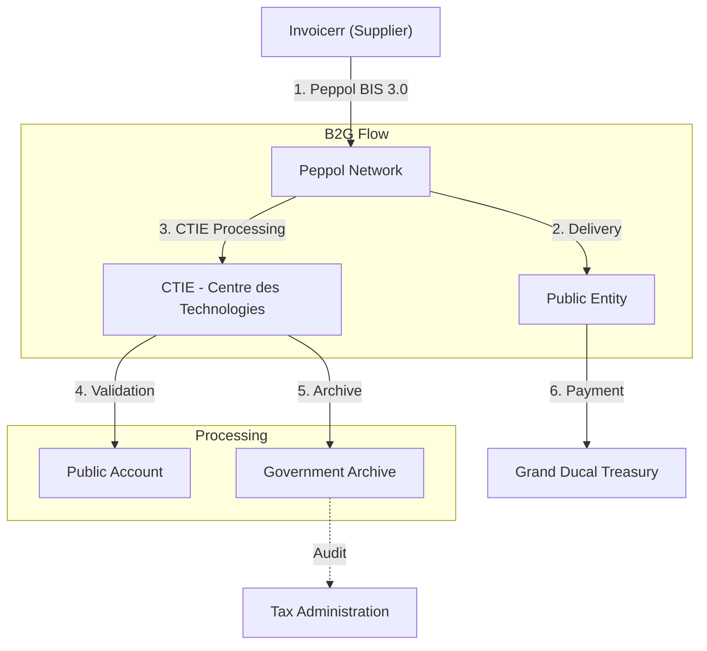

# 🇱🇺 Luxembourg - E-Invoicing Specifications

**Status:** 🟢 **B2G Active** | 🔴 **B2B Voluntary** | 🟡 **ViDA 2030**
**Authority:** Tax Administration (Administration des contributions directes)
**Platform:** Peppol / MyGuichet

---

## 1. Context & Overview

Luxembourg has mandatory B2G e-invoicing with phased implementation completed in 2023. B2B e-invoicing is voluntary but the country is preparing for ViDA 2030 requirements.

| Date | Scope | Obligation |
| --- | --- | --- |
| **May 2019** | B2G Law | Law on e-Invoicing in Public Procurement enacted |
| **Apr 2020** | B2G Sub-central | Municipalities must receive e-invoices |
| **May 2022** | Large Companies | Mandatory B2G e-invoicing for large enterprises |
| **Jan 2023** | All Sizes | Full B2G e-invoicing mandatory |
| **2030** | B2B ViDA | Mandatory e-invoicing under ViDA directive |

---

## 2. Technical Workflow

### 🧱 Key Components

1. **Peppol Network:** Primary e-invoice delivery infrastructure
2. **CTIE:** Centre des Technologies de l'Information de l'État
3. **MyGuichet:** National government portal

---

## 3. Data Standards & Formats

### A. Accepted Formats

* **Peppol BIS Billing 3.0** (recommended)
* **UBL 2.1** syntax
* **UN/CEFACT CII** format
* **EN 16931** compliant XML

### B. Critical Data Fields

* **TIN:** Luxembourg tax ID
* **VAT Number:** Numéro de TVA
* **Peppol Participant ID:** Network identifier

---

## 4. Business Model

* **B2G Post-Audit:** Invoice delivery via Peppol
* **B2B Post-Audit:** Voluntary, no clearance required
* **Monitoring Framework:** Peppol service providers report monthly

---

## 5. Implementation Checklist

* [ ] **Peppol Access:** Obtain Peppol participant identifier
* [ ] **B2G Registration:** Register with CTIE/MyGuichet
* [ ] **Peppol BIS 3.0:** Implement recommended format
* [ ] **ViDA Preparation:** Plan for 2030 B2B mandate
* [ ] **Archive Setup:** Configure 10-year storage

---

## 6. Resources

* **Tax Administration:** [Impotsdirects.gouv.lu](https://www.impotsdirects.gouv.lu)
* **MyGuichet:** [Myguichet.public.lu](https://www.myguichet.public.lu)
* **CTIE:** [Ctie.public.lu](https://www.ctie.public.lu)
* **Peppol Luxembourg:** [Peppol.lu](https://www.peppol.lu)
