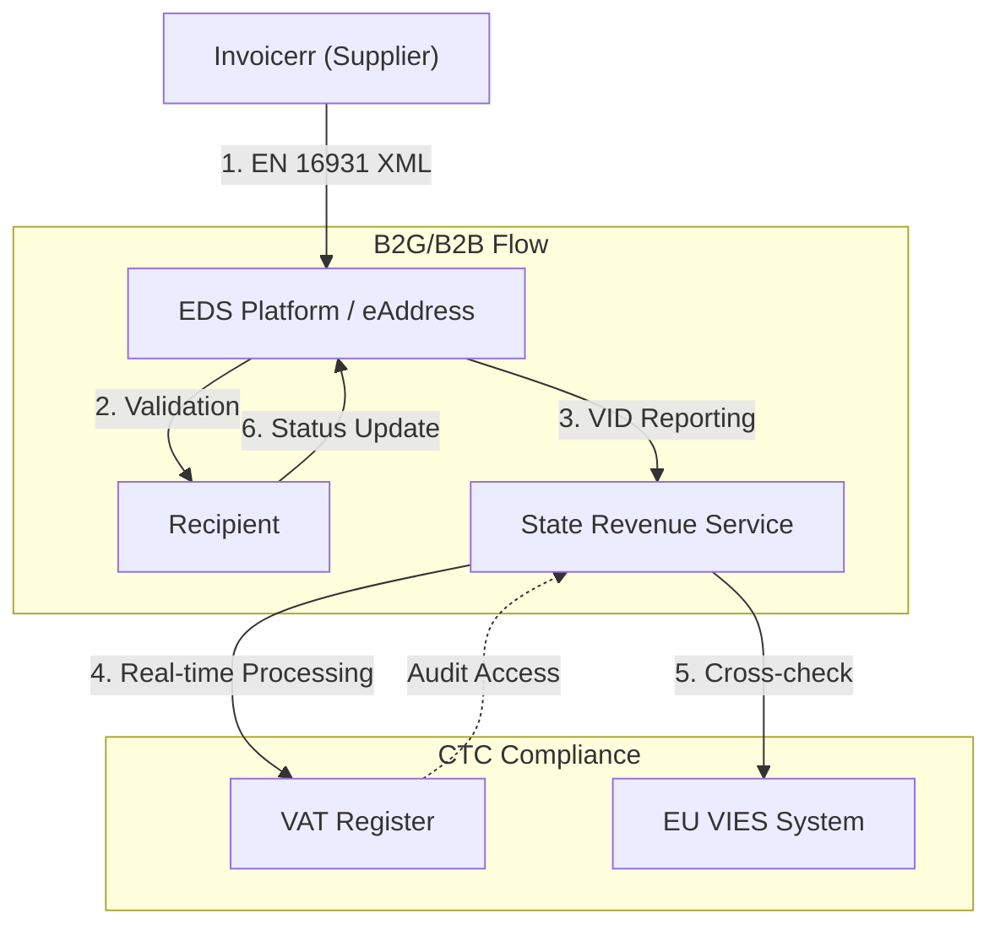

# 🇱🇻 Latvia - E-Invoicing Specifications

**Status:** 🟢 **B2G Active** | 🟡 **B2B Voluntary 2026** | 🟢 **Mandatory B2B 2028**
**Authority:** State Revenue Service (VID)
**Platform:** EDS / eAddress / Peppol

---

## 1. Context & Overview

Latvia has mandatory B2G e-invoicing from January 2025. B2B e-invoicing is voluntary with a government platform opening in March 2026, with full mandatory B2B from January 2028 under Shadow Economy Curtailment Plan.

| Date | Scope | Obligation |
| --- | --- | --- |
| **Jan 1, 2025** | B2G | Mandatory e-invoices to budget entities |
| **Jan 1, 2026** | B2B Data | Mandatory e-invoice data reporting to VID |
| **Mar 30, 2026** | B2B Platform | Government e-invoice platform opens for B2B |
| **Jan 1, 2028** | B2B All | Full mandatory B2B e-invoicing |

---

## 2. Technical Workflow

### 🧱 Key Components

1. **EDS (Electronic Declaration System):** Government e-invoicing platform
2. **eAddress:** Free e-invoicing platform (VDAA)
3. **VID Integration:** Real-time reporting to tax authority

---

## 3. Data Standards & Formats

### A. Accepted Formats

* **EN 16931** compliant XML (EU standard)
* **Peppol BIS Billing 3.0** (recommended)
* **UBL 2.1** syntax

### B. Critical Data Fields

* **VN:** Latvian tax ID
* **PVN:** Latvian VAT number
* **eAddress:** Registered e-invoice address

---

## 4. Business Model

* **Clearance Model:** Invoice data submitted to VID in near real-time
* **CTC Approach:** Continuous Transaction Control
* **VIES Integration:** EU cross-border data sharing

---

## 5. Implementation Checklist

* [ ] **EDS Registration:** Register for State Revenue Service access
* [ ] **eAddress Setup:** Obtain e-invoice address
* [ ] **EN 16931 Compliance:** Implement structured XML format
* [ ] **Peppol Access:** Set up Peppol connectivity
* [ ] **Archive Configuration:** Set up required storage period

---

## 6. Resources

* **State Revenue Service:** [Vid.gov.lv](https://www.vid.gov.lv)
* **EDS Portal:** [Eds.vid.gov.lv](https://eds.vid.gov.lv)
* **eAddress Platform:** [Eadrese.lv](https://www.eadrese.lv)
* **VDAA:** [Vdaa.gov.lv](https://www.vdaa.gov.lv)
