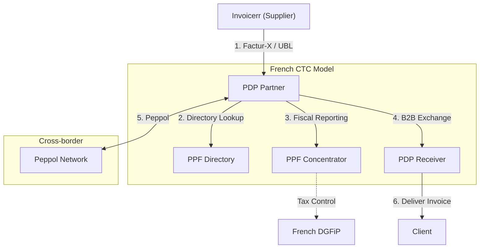

# 🇲🇨 Monaco - E-Invoicing Specifications

**Status:** 🟢 **Following France** | 🟢 **B2G Active** | 🟡 **B2B Sep 2026**
**Authority:** Department of Finance / French DGFiP
**Platform:** French PDP/PPF Framework

---

## 1. Context & Overview

Monaco follows France's e-invoicing regulations for businesses with French SIREN registration. Full French B2B mandate applies from September 2026 for entities registered in the French companies register.

| Date | Scope | Obligation |
| --- | --- | --- |
| **Ongoing** | B2G | Follow French B2G (Chorus Pro) |
| **Sep 2026** | B2B Large | Large enterprises must issue e-invoices |
| **Sep 2027** | B2B SME | SMEs and micro-enterprises must issue e-invoices |
| **Sep 2026** | B2B All | All companies must receive e-invoices |

---

## 2. Technical Workflow

### 🧱 Key Components

1. **PDP (Partner Dematerialization Platform):** Certified private platforms
2. **PPF (Public Portal):** Directory and fiscal data concentrator
3. **Factur-X:** Hybrid PDF/XML format (EN 16931)

---

## 3. Data Standards & Formats

### A. Accepted Formats

* **Factur-X** (PDF/A-3 with embedded XML)
* **UBL 2.1** syntax
* **CII (Cross Industry Invoice)** format
* **EN 16931** compliant XML

### B. Critical Data Fields

* **SIREN/SIRET:** French business registration (for Monaco entities)
* **TVA Intracommunautaire:** EU VAT number
* **PDP Identifier:** Platform routing code

---

## 4. Business Model

* **Clearance Model:** French CTC model with PDP/PPF
* **French Alignment:** Full technical requirements same as France
* **Peppol Access:** Available for cross-border

---

## 5. Implementation Checklist

* [ ] **SIREN Registration:** Ensure French business registration
* [ ] **PDP Selection:** Choose certified PDP provider
* [ ] **Factur-X Engine:** Implement hybrid PDF/XML format
* [ ] **PPF Directory:** Register for directory services
* [ ] **Lifecycle Management:** Build status update workflows
* [ ] **Archive Setup:** Configure 10-year storage

---

## 6. Resources

* **Department of Finance:** [Gouv.mc](https://www.gouv.mc)
* **French DGFiP:** [Impots.gouv.fr](https://www.impots.gouv.fr)
* **FNFE-MPE:** [Fnfe-mpe.org](https://www.fnfe-mpe.org)
* **Chorus Pro:** [Chorus-pro.gouv.fr](https://www.chorus-pro.gouv.fr)
