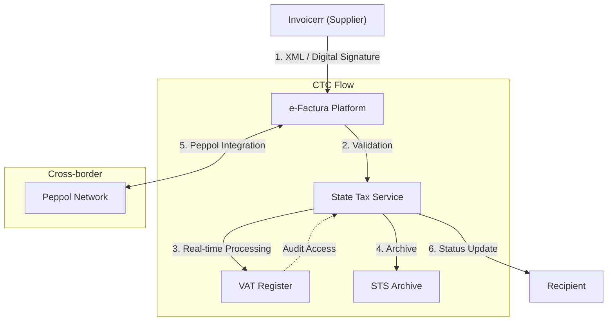

# 🇲🇩 Moldova - E-Invoicing Specifications

**Status:** 🟢 **B2G Active** | 🟢 **B2B Mandatory Oct 2026**
**Authority:** State Tax Service (STS)
**Platform:** e-Factura / SIA

---

## 1. Context & Overview

Moldova has a comprehensive CTC framework with mandatory B2G e-invoicing since 2023. Full B2B e-invoicing becomes mandatory on October 1, 2026, following a pilot in January 2026.

| Date | Scope | Obligation |
| --- | --- | --- |
| **2014** | e-Factura | Voluntary e-invoicing system launched |
| **2021** | B2G | Mandatory B2G e-invoicing |
| **2023** | B2G All | Full B2G e-invoicing mandatory |
| **Jan 2026** | B2B Pilot | Voluntary testing of mandatory flows |
| **Oct 1, 2026** | B2B All | Full mandatory B2B e-invoicing |

---

## 2. Technical Workflow

### 🧱 Key Components

1. **e-Factura:** National e-invoicing platform
2. **Digital Signature:** Mandatory for invoice authentication
3. **Peppol Integration:** Cross-border interoperability
4. **eBon:** Electronic receipts for B2C

---

## 3. Data Standards & Formats

### A. Accepted Formats

* **National XML format** (e-Factura schema)
* **Digital Signature:** Mandatory (qualified)
* **Peppol BIS:** For cross-border (future)

### B. Critical Data Fields

* **IDNO:** Moldovan business registration number
* ** TVA:** VAT registration number
* **Fiscal Number:** Unique fiscal identifier

---

## 4. Business Model

* **Clearance Model:** Real-time invoice validation through e-Factura
* **Broad Scope:** B2B, B2G, and cross-border exports
* **eBon System:** Parallel B2C digital receipts

---

## 5. Implementation Checklist

* [ ] **e-Factura Registration:** Register with State Tax Service
* [ ] **Digital Signature:** Obtain qualified electronic signature
* [ ] **XML Format:** Implement national e-Factura schema
* [ ] **Real-time Integration:** API connection to e-Factura
* [ ] **Peppol Setup:** Prepare for cross-border interoperability
* [ ] **Archive Configuration:** Set up required storage period

---

## 6. Resources

* **State Tax Service:** [Sfs.md](https://www.sfs.md)
* **e-Factura Portal:** [Servicii.fisc.md](https://servicii.fisc.md)
* **Ministry of Finance:** [Finance.gov.md](https://www.finance.gov.md)
