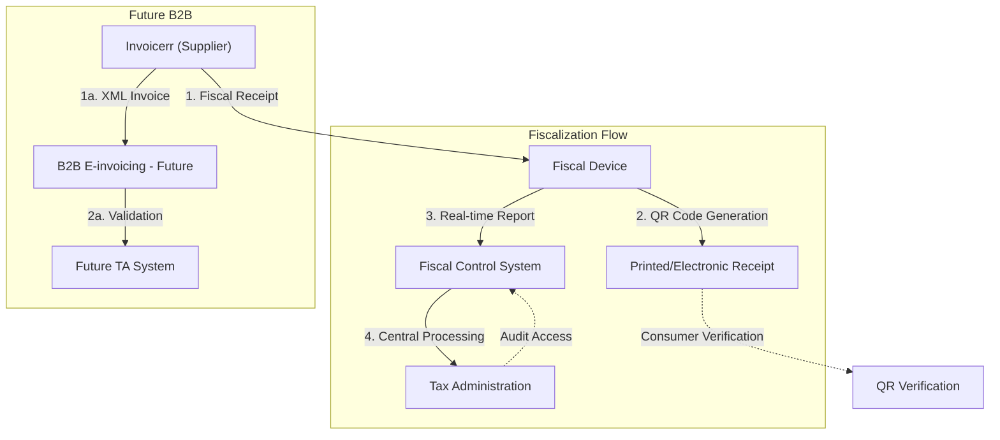

# 🇲🇪 Montenegro - E-Fiscalization Specifications

**Status:** 🟡 **E-Fiscalization** | 🟢 **B2G Active** | 🔴 **B2B Planned**
**Authority:** Tax Administration (Poreska uprava)
**Platform:** Fiscal Control System / Fiscal Devices

---

## 1. Context & Overview

Montenegro is implementing e-fiscalization focusing on fiscal devices and real-time transaction reporting. B2B e-invoicing is still in planning stages.

| Date | Scope | Obligation |
| --- | --- | --- |
| **Ongoing** | Retail | Fiscal device certification required |
| **2024** | E-fiscalization | System modernization in progress |
| **TBD** | B2B | Extended e-fiscalization under development |
| **TBD** | E-invoicing | Full B2B e-invoicing framework |

---

## 2. Technical Workflow

### 🧱 Key Components

1. **Fiscal Devices:** Certified cash registers and printers
2. **FCS (Fiscal Control System):** Central monitoring platform
3. **QR Codes:** Receipt verification mechanism

---

## 3. Data Standards & Formats

### A. Accepted Formats

* **Fiscal Receipt Format:** National standard
* **XML-based Reporting:** For fiscal devices
* **QR Code:** For receipt verification
* **Future E-invoice:** EN 16931 (planned)

### B. Critical Data Fields

* **TIN:** Montenegrin tax ID
* **Fiscal Number:** Device registration
* **Transaction ID:** Unique fiscal identifier

---

## 4. Business Model

* **Fiscalization Model:** Real-time transaction reporting
* **Certified Devices:** Mandatory fiscal hardware
* **Future E-invoicing:** Framework under development

---

## 5. Implementation Checklist

* [ ] **Fiscal Device:** Obtain certified fiscal device
* [ ] **FCS Registration:** Register with Fiscal Control System
* [ ] **QR Compliance:** Implement receipt QR generation
* [ ] **E-invoicing Monitoring:** Track B2B framework development
* [ ] **Archive Setup:** Configure transaction data storage

---

## 6. Resources

* **Tax Administration:** [Poreskauprava.gov.me](https://www.poreskauprava.gov.me)
* **Government:** [Gov.me](https://www.gov.me)
