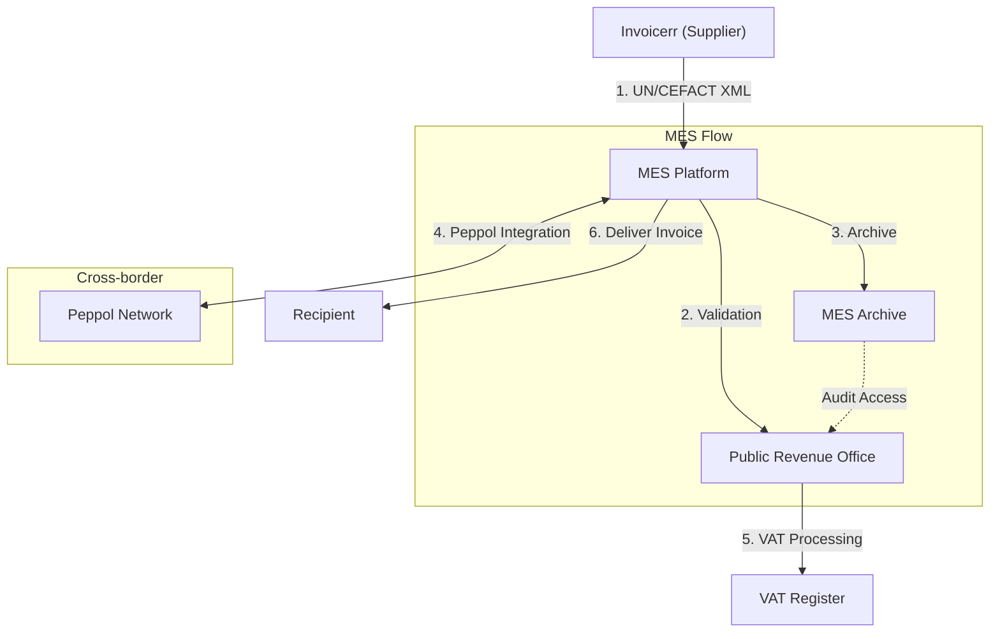

# 🇲🇰 North Macedonia - E-Invoicing Specifications

**Status:** 🟢 **Mandatory** | 🟢 **B2G/B2B Active**
**Authority:** Public Revenue Office (PRO)
**Platform:** MES (Makedonski Elektronski Sistem)

---

## 1. Context & Overview

North Macedonia has mandatory e-invoicing for both B2G and B2B transactions through the MES platform. The system supports domestic and cross-border electronic document exchange.

| Date | Scope | Obligation |
| --- | --- | --- |
| **2015** | B2G | Mandatory e-invoicing for public sector |
| **2015+** | B2B | Progressive extension to all B2B |
| **Ongoing** | All | Continuous MES reporting mandatory |
| **2030** | Cross-border | ViDA alignment for intra-EU B2B |

---

## 2. Technical Workflow

### 🧱 Key Components

1. **MES:** Macedonian Electronic Invoice System
2. **PRO:** Public Revenue Office (regulator)
3. **Peppol Integration:** Cross-border interoperability

---

## 3. Data Standards & Formats

### A. Accepted Formats

* **UN/CEFACT** syntax (primary format)
* **National XML format:** MES schema
* **Peppol BIS:** For cross-border

### B. Critical Data Fields

* **TIN:** Macedonian tax ID
* **VAT Number:** VAT registration
* **MES Registration:** Platform identifier

---

## 4. Business Model

* **Clearance Model:** Invoice validation through MES
* **Universal Scope:** All B2B and B2G transactions
* **Cross-border Ready:** Peppol integration available

---

## 5. Implementation Checklist

* [ ] **MES Registration:** Register with Public Revenue Office
* [ ] **UN/CEFACT Support:** Implement Macedonian format
* [ ] **Peppol Access:** Set up cross-border connectivity
* [ ] **API Integration:** Connect to MES platform
* [ ] **Archive Configuration:** Set up required storage

---

## 6. Resources

* **Public Revenue Office:** [Upr.gov.mk](https://www.upr.gov.mk)
* **MES Portal:** [E-faktura.gov.mk](https://www.e-faktura.gov.mk)
* **Government:** [Gov.mk](https://www.gov.mk)
