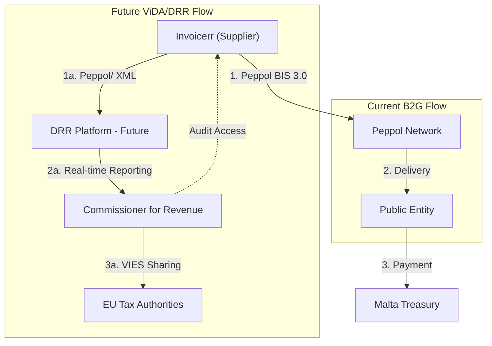

# 🇲🇹 Malta - E-Invoicing Specifications

**Status:** 🟢 **B2G Active** | 🟡 **ViDA Phased 2028-2035**
**Authority:** Commissioner for Revenue (CFR)
**Platform:** Peppol / Future DRR Platform

---

## 1. Context & Overview

Malta has semi-mandatory B2G e-invoicing where public authorities must receive e-invoices. B2B e-invoicing is voluntary but the country is preparing a phased Digital Real-Time Reporting (DRR) approach aligned with ViDA.

| Date | Scope | Obligation |
| --- | --- | --- |
| **Ongoing** | B2G Receive | Public authorities must receive EN 16931 e-invoices |
| **2025** | DRR Planning | Digital Real-Time Reporting framework development |
| **2028** | Large Corps | ViDA phase for large businesses |
| **2030** | Cross-border | Mandatory intra-EU B2B e-invoicing |
| **2035** | All B2B | Full domestic B2B e-invoicing mandate |

---

## 2. Technical Workflow

### 🧱 Key Components

1. **Peppol Network:** Current e-invoice delivery
2. **DRR Platform:** Future Digital Real-Time Reporting system
3. **MTCA:** Malta Tax and Customs Administration

---

## 3. Data Standards & Formats

### A. Accepted Formats

* **EN 16931** compliant XML (mandatory for B2G)
* **Peppol BIS Billing 3.0** (recommended)
* **UBL 2.1** syntax

### B. Critical Data Fields

* **VAT Number:** Maltese VAT registration
* **TIN:** Tax ID number
* **Malta Registration Number:** Company registration

---

## 4. Business Model

* **B2G Semi-Mandatory:** Public authorities must receive e-invoices
* **Future DRR:** Real-time reporting to tax authority
* **ViDA Alignment:** Phased approach to 2035

---

## 5. Implementation Checklist

* [ ] **Peppol Access:** Obtain Peppol participant identifier
* [ ] **B2G Setup:** Register for government e-invoicing
* [ ] **EN 16931 Compliance:** Implement structured format
* [ ] **DRR Preparation:** Monitor DRR platform development
* [ ] **ViDA Planning:** Roadmap for 2028-2035 mandates
* [ ] **Archive Setup:** Configure required storage

---

## 6. Resources

* **Commissioner for Revenue:** [Cfr.gov.mt](https://www.cfr.gov.mt)
* **Malta Chamber:** [Maltachamber.org.mt](https://www.maltachamber.org.mt)
* **EU ViDA:** [ec.europa.eu/vida](https://ec.europa.eu)
