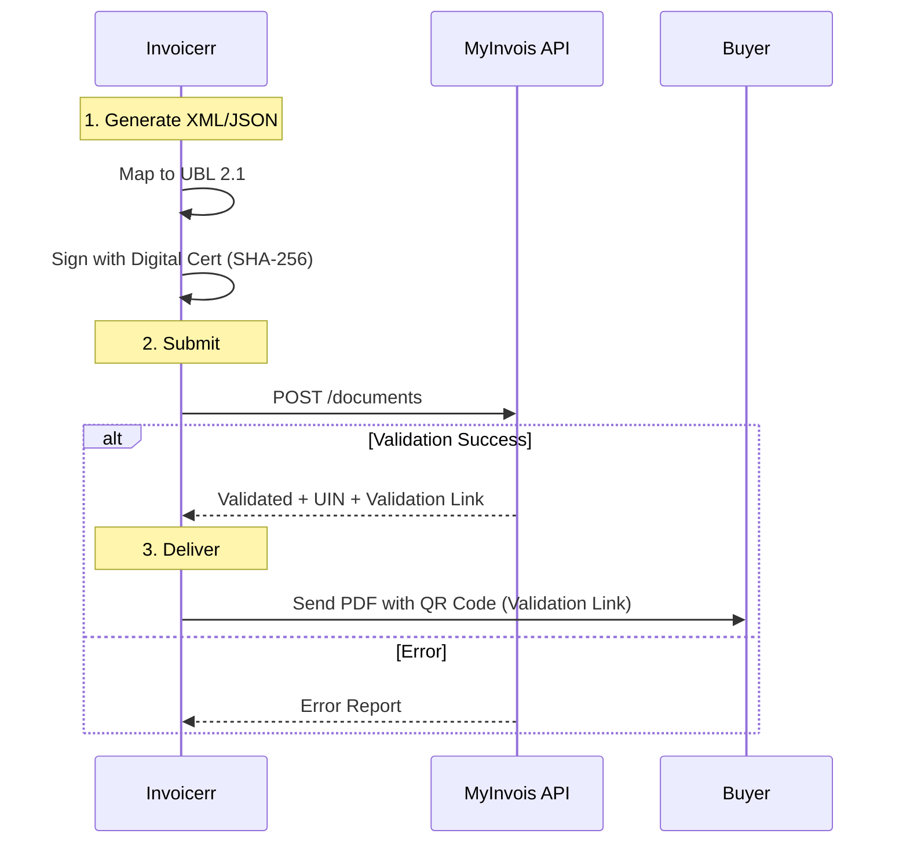

# 🇲🇾 Malaysia - Invoicing Specifications (MyInvois)

**Status:** 🔴 **Mandatory Clearance** (Phased Implementation)
**Authority:** LHDNM (Inland Revenue Board of Malaysia / IRBM)
**Platform:** **MyInvois** System

---

## 1. Context & Roadmap

Malaysia is transitioning to a **Clearance** model similar to Italy or Saudi Arabia.
**Crucial Rule:** Invoices must be validated by the MyInvois Portal/API *before* being sent to the buyer.

| Date | Scope | Obligation |
| --- | --- | --- |
| **Aug 1, 2024** | **> RM 100 million** | Phase 1 mandatory implementation. |
| **Jan 1, 2025** | **> RM 25 million** | Phase 2 mandatory. |
| **Jul 1, 2025** | **Current Stage** | Mandatory for all businesses. |
| **B2C** | **Consolidated** | B2C transactions can be consolidated monthly (e-Invoice), except for certain sectors. |

---

## 2. Technical Workflow (Clearance)

The invoice is not legal until it has a Unique Identifier Number (UIN) from IRBM.

### 🧱 Key Components

1. **UIN (Unique Identifier Number):** Assigned by IRBM upon validation.
2. **Validation Link:** A URL generated by IRBM to verify the invoice.
3. **QR Code:** Must be embedded in the PDF and contain the Validation Link.
4. **TIN (Tax Identification Number):** Mandatory for both supplier and buyer (except B2C).

---

## 3. Data Standards & Requirements

### A. Format: `UBL 2.1` (XML or JSON)

* **Syntax:** Standard UBL.
* **Constraints:**
* **Buyer TIN:** Essential. If B2C (individual), use general TIN `EI00000000010`.
* **Classification Codes:** Products/Services must be mapped to IRBM classification codes (e.g., `001` for General Goods).

### B. Business Rules

* **Consolidated e-Invoice:** For B2C, you issue a normal receipt to the customer, but aggregate them into one "Consolidated e-Invoice" to send to IRBM monthly (within 7 days after month-end).
* **Self-Billed e-Invoice:** Required for foreign suppliers (imports), dividend distribution, and e-commerce payouts.

---

## 4. Implementation Checklist

* [ ] **MyInvois API:** Implement the OAuth 2.0 connection to the MyInvois system (Sandpit & Production).
* [ ] **Digital Signature:** Integrate a signing module (X.509 certificate) to sign the payload before submission.
* [ ] **TIN Validator:** Validate the format of the Buyer's TIN (`IG` / `C` + 10 digits).
* [ ] **QR Code Engine:** Generate the QR code containing the URL returned by the API.
* [ ] **Consolidation Logic:** Build a monthly job to aggregate B2C receipts into a single e-Invoice submission.

---

## 5. Resources

* **Official Portal:** [MyInvois Portal](https://myinvois.hasil.gov.my/)
* **SDK & Guide:** [MyInvois SDK](https://sdk.myinvois.hasil.gov.my/)
* **General TINs:** [TIN List](https://www.hasil.gov.my/)