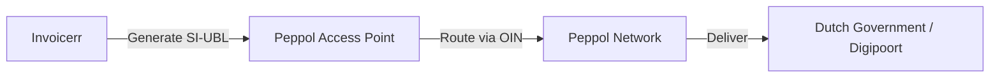

# 🇳🇱 Netherlands - Invoicing Specifications (Peppol / Digipoort)

**Status:** 🟡 **Voluntary B2B** | 🟢 **Mandatory B2G**
**Authority:** Logius (Digipoort) / NPa (Dutch Peppol Authority)
**Standard:** **SI-UBL 2.0** (NLCIUS)

---

## 1. Context & Roadmap

The Netherlands follows a "Polder Model": strong consensus, fewer strict mandates.
**Crucial Distinction:**

* **B2B 2026:** No legal mandate. E-invoicing remains voluntary (buyer consent required).
* **B2G:** Mandatory for suppliers to the Central Government (since 2017) and Local Gov (since 2019).

| Date | Scope | Obligation |
| --- | --- | --- |
| **Active** | **B2G** | Central Gov requires XML (Digipoort/Peppol). |
| **Active** | **B2G (Local)** | Provinces/Municipalities must be able to receive XML. |
| **Jan 1, 2026** | **B2B** | **Still Voluntary**. No "Big Bang" like Belgium. |
| **~2030** | **B2B** | Likely alignment with EU ViDA (CTC). |

---

## 2. Technical Workflow (B2G Channels)

To invoice the Dutch Government, Invoicerr must use one of these channels:

### Channel A: Peppol (The Preferred Highway)

* **Strategy:** Recommended for all suppliers.
* **Flow:** Invoicerr (C1) -> Access Point -> NPa Network -> Gov Access Point -> Digipoort (Internal).
* **Identifier:** The **OIN** is crucial.

### Channel B: Digipoort (The Heavy Hub)

* **Strategy:** For high-volume legacy suppliers.
* **Tech:** Requires PKIoverheid certificates and direct XML connection. **Not recommended** for a SaaS like Invoicerr unless serving enterprise clients directly.

---

## 3. Data Standards & Identifiers

### A. Format: `SI-UBL 2.0`

* **Description:** The Dutch implementation of EN 16931 (NLCIUS).
* **Validation:** Strict rules on VAT codes and References.

### B. Routing Keys (The "OIN")

The standard VAT number is often not enough for routing B2G.

* **OIN (Organisatie-identificatienummer):** 20 digits. Used to identify specific ministries.
* *Peppol Scheme:* `0190`

* **KVK (Chamber of Commerce):** 8 digits. Used for B2B.
* *Peppol Scheme:* `0106`

* **BTW (VAT):** Used for cross-border.
* *Peppol Scheme:* `9944`

---

## 4. Implementation Checklist

* [ ] **Peppol First:** Ignore Digipoort direct connection. Connect via Peppol.
* [ ] **OIN Field:** Add a specific field for "OIN" in the client profile. If the client is a Dutch Ministry, this field is mandatory.
* [ ] **Format Engine:** Output `SI-UBL 2.0`.
* [ ] **Email Fallback:** Since B2B is voluntary, keep the "Send PDF via Email" feature active for Dutch private clients.

---

## 5. Resources

* **Official B2G Info:** [Helpdesk E-factureren](https://www.helpdesk-efactureren.nl/)
* **Peppol Authority:** [NPa (Nederlandse Peppolautoriteit)](https://www.peppolautoriteit.nl/)
* **Simplerinvoicing (Community):** [Simplerinvoicing](https://simplerinvoicing.org/)