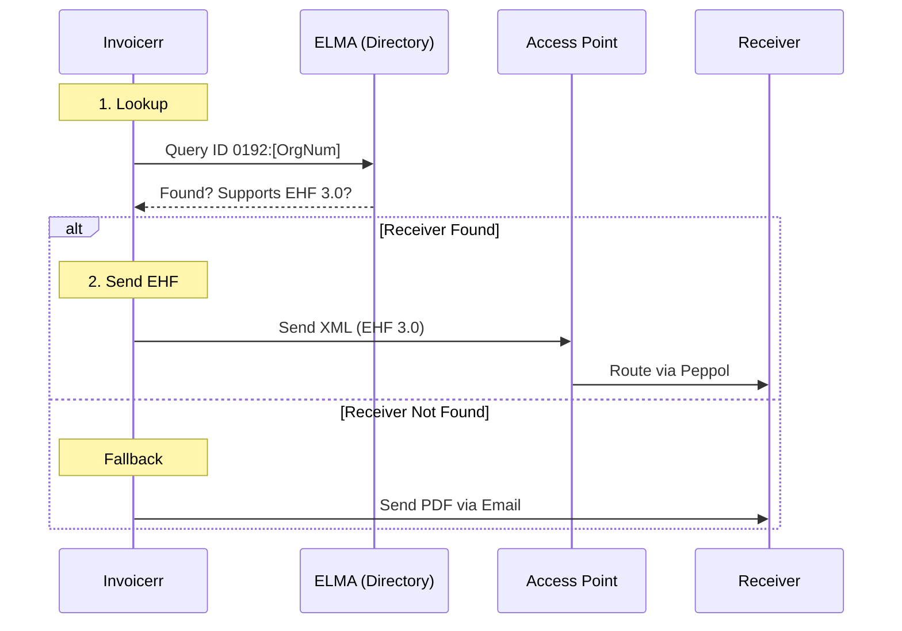

# 🇳🇴 Norway - Invoicing Specifications (EHF / Peppol)

**Status:** 🟡 **Voluntary B2B** (De facto standard) | 🟢 **Mandatory B2G**
**Authority:** DFØ (Norwegian Agency for Public and Financial Management)
**Standard:** **EHF Billing 3.0** (Peppol BIS 3.0)

---

## 1. Context & Roadmap

Norway is a mature e-invoicing market. While B2B is technically "voluntary" in 2026, most companies expect EHF invoices.

| Date | Scope | Obligation |
| --- | --- | --- |
| **Active** | **B2G** | **Mandatory emission** for all suppliers to public entities. |
| **Active** | **B2B** | Voluntary, but dominant. Sending PDF is considered unprofessional. |
| **~2028** | **B2B** | Proposed legal mandate for all B2B transactions. |

---

## 2. Technical Workflow (ELMA & Peppol)

The Norwegian ecosystem relies entirely on **Peppol**. The key component is the **ELMA** registry (The Norwegian SMP).

### 🧱 Key Components

1. **EHF Billing 3.0:** The local name for Peppol BIS 3.0. Technologically identical to the EU standard UBL.
2. **ELMA:** The national directory where companies register to receive invoices. Invoicerr must check this before sending.
3. **KID (Customer ID):** A structured payment reference (like OCS in Belgium). Critical for bank reconciliation.

---

## 3. Data Standards & Identifiers

### A. Identifiers (ICD 0192)

* **Organization Number:** 9 digits (e.g., `991825827`).
* **Peppol Scheme:** **`0192`**.
* *Warning:* Do not use `9908` (Deprecated).
* *Correct Endpoint ID:* `0192:991825827`.

### B. Critical Fields

* **VAT ID format:** `NO` + 9 digits + `MVA` (e.g., `NO991825827MVA`).
* **Payment Reference:** Map the **KID** number to `cbc:PaymentID`.
* **Buyer Reference:** Mandatory for B2G. Usually a user ID or PO number (`Deres ref`).

---

## 4. Implementation Checklist

* [ ] **Peppol Strategy:** Use the standard Peppol engine. No custom XML needed (EHF = BIS 3.0).
* [ ] **Prefix Logic:** Hardcode the `0192` prefix for Norwegian clients in the Peppol address builder.
* [ ] **ELMA Lookup:** Implement a "Check capability" button or background job to query the directory.
* [ ] **KID Field:** Add a specific "KID" input field for invoices to Norway, mapping to the Payment ID tag.

---

## 5. Resources

* **Official Authority:** [DFØ (Anskaffelser)](https://www.anskaffelser.no/)
* **EHF Documentation:** [EHF Billing 3.0 Guide](https://anskaffelser.dev/postaward/g3/spec/)
* **ELMA Registry:** [ELMA Info](https://www.google.com/search?q=https://www.anskaffelser.no/verktoy/elma)