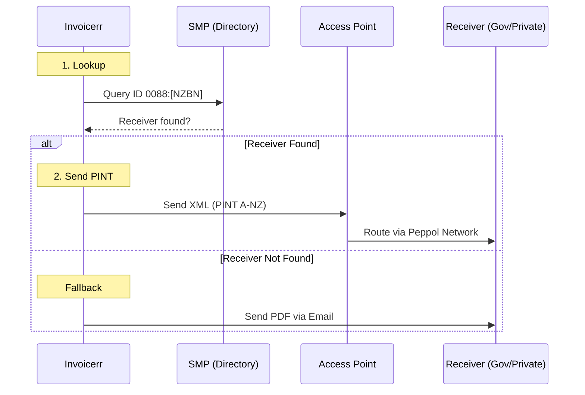

# 🇳🇿 New Zealand - Invoicing Specifications (Peppol / PINT A-NZ)

**Status:** 🟡 **Voluntary B2B** | 🟢 **Mandatory B2G** (Emission & Reception)
**Authority:** MBIE (Ministry of Business, Innovation and Employment)
**Standard:** **Peppol PINT A-NZ** (since May 2025)

---

## 1. Context & Roadmap

New Zealand works closely with Australia to implement the Trans-Tasman e-invoicing framework.
**Crucial Distinction:**

* **B2G Emission:** As of **Jan 1, 2026**, Government Agencies processing >2000 invoices/year MUST be able to *send* and *receive* e-invoices.
* **Payment Target:** Agencies must pay e-invoices within **5 working days**.
* **Standard:** Moved from BIS Billing 3.0 to **PINT A-NZ** to align with global standards.

| Date | Scope | Obligation |
| --- | --- | --- |
| **Active** | **B2G (Central)** | Central agencies must receive e-invoices. |
| **Jan 1, 2026** | **B2G (High Volume)** | Agencies >2k invoices/yr must Send & Receive via Peppol. |
| **Jan 1, 2027** | **Large Suppliers** | Suppliers with turnover > $33M NZD must send e-invoices to Gov. |

---

## 2. Technical Workflow (Peppol Only)

New Zealand relies entirely on the **Peppol Network**.

### 🧱 Key Components

1. **PINT A-NZ:** The XML standard. (Identical to Australia's PINT implementation).
2. **NZBN (New Zealand Business Number):** The unique 13-digit identifier for all businesses.
3. **MBIE:** The Peppol Authority managing the framework.

---

## 3. Data Standards & Identifiers

### A. Identifiers (ICD 0088)

* **NZBN:** 13 digits (e.g., `9429030000000`).
* **Peppol Scheme:** **`0088`**.
* *Correct Endpoint ID:* `0088:9429030000000`.

### B. Critical Fields

* **GST:** Standard rate is 15%. Code `S`. Zero-rated is `Z`.
* **Buyer Reference:** Mandatory for B2G (Purchase Order).
* **Payment Terms:** Crucial to ensure the 5-day payment promise.

---

## 4. Implementation Checklist

* [ ] **Peppol Engine:** Use **PINT A-NZ** (same engine as Australia).
* [ ] **NZBN Lookup:** Implement a lookup using the **MBIE API** to find a client's NZBN by name.
* [ ] **Prefix Logic:** Hardcode `0088` prefix for NZ clients.
* [ ] **PO Field:** Mandatory for B2G clients.

---

## 5. Resources

* **Official Authority:** [eInvoicing (MBIE)](https://www.einvoicing.govt.nz/)
* **NZBN Register:** [NZBN API](https://www.nzbn.govt.nz/)
* **Peppol Directory:** [Directory Lookup](https://directory.peppol.eu)