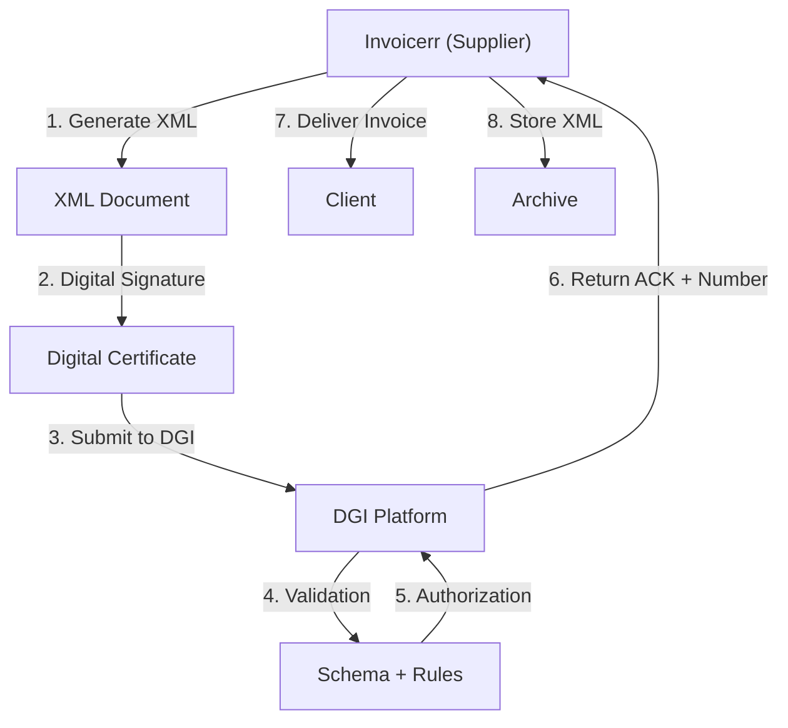

# 🇵🇦 Panama - E-Invoicing Specifications (FE/CF)

**Status:** 🟢 **Mandatory** | Active for all businesses
**Authority:** DGI (Dirección General de Ingresos)
**Platform:** DGI Electronic Invoice System (FE/CF)

---

## 1. Context & Overview

Panama has mandatory e-invoicing (factura electrónica / comprobante fiscal) through DGI. The system follows a **Clearance Model** requiring pre-authorization. Progressive rollout began in 2018.

| Date | Scope | Obligation |
| --- | --- | --- |
| **2018+** | Progressive | Initial rollout by sector |
| **Ongoing** | All businesses | Continuous DGI authorization |
| **Current** | Full mandatory | All transaction types |

---

## 2. Technical Workflow (Clearance)

### 🧱 Key Components

1. **RUC (Registro Único de Contribuyente):** Tax ID
2. **Digital Certificate:** DGI-approved

---

## 3. Data Standards & Formats

### A. Required Format

- **XML Format:** DGI schema
- **Encoding:** UTF-8
- **Digital Signature:** Required

### B. Document Types

| Code | Type | Description |
| --- | --- | --- |
| **01** | Factura Electrónica | Invoice |
| **02** | Nota Débito | Debit note |
| **03** | Nota Crédito | Credit note |

### C. Critical Data Fields

- **RUC:** Tax ID (15 digits)
- **ITBMS:** VAT (7% / 10% / 15%)
- **Número Autorización:** Authorization number

---

## 4. Business Model & Compliance

### A. Workflow

1. **RUC Registration:** Obtain Panamanian tax ID
2. **Certificate:** Acquire DGI digital certificate
3. **XML Generation:** Create schema-compliant document
4. **Signing:** Apply electronic signature
5. **Submission:** Send to DGI
6. **Delivery:** Send to buyer

### B. Archiving

- **Retention:** 5 years
- **Format:** Original XML

---

## 5. Implementation Checklist

- [ ] **RUC Registration:** Obtain Panamanian tax ID
- [ ] **Digital Certificate:** Acquire DGI certificate
- [ ] **XML Engine:** Build DGI schema generator
- [ ] **Signature Integration:** Implement signing
- [ ] **DGI API:** Connect to web services

---

## 6. Resources

- **DGI Portal:** [Dgi.gob.pa](https://www.dgi.gob.pa)
