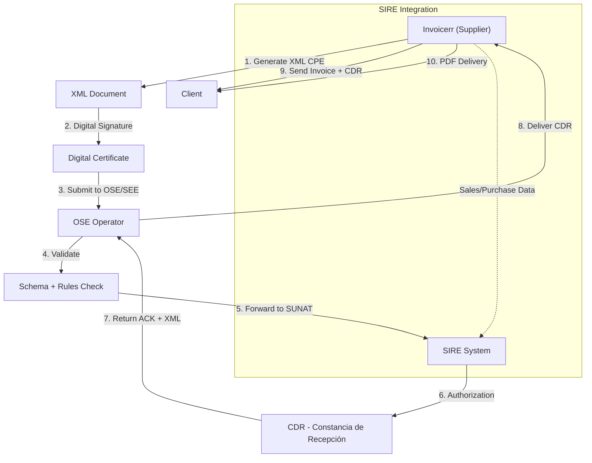

# 🇵🇪 Peru - E-Invoicing Specifications (CPE - Comprobante de Pago Electrónico)

**Status:** 🟢 **Mandatory** | Active for all taxpayers
**Authority:** SUNAT (Superintendencia Nacional de Aduanas y de Administración Tributaria)
**Platform:** SEE (Sistema de Emisión Electrónica)

---

## 1. Context & Overview

Peru has one of Latin America's most comprehensive e-invoicing systems. Mandatory for nearly all registered taxpayers since June 2022, the system covers all business transactions (B2B, B2G, B2C) with a **Clearance Model** requiring SUNAT validation. The SIRE system for integrated electronic records has enforcement extended to January 2026.

| Date | Scope | Obligation |
| --- | --- | --- |
| **2010** | SEE Launch | Initial e-invoicing program |
| **2017-2022** | Progressive | Phased mandatory rollout |
| **Jun 1, 2022** | All taxpayers | Full mandatory adoption |
| **2024** | SIRE | Integrated records system |
| **Jan 2026** | SIRE Major | Full enforcement for large taxpayers |
| **Ongoing** | All transactions | Continuous SUNAT reporting |

---

## 2. Technical Workflow (Clearance Model)

Peru requires near real-time validation through SUNAT or authorized OSE (Operador de Servicios Electrónicos).

### 🧱 Key Components

1. **CPE (Comprobante de Pago Electrónico):** Electronic payment receipt (invoice/receipt)
2. **OSE (Operador de Servicios Electrónicos):** Authorized service operator
3. **CDR (Constancia de Recepción):** Reception acknowledgment from SUNAT
4. **SIRE (Sistema Integrado de Registros Electrónicos):** Integrated electronic records
5. **Digital Certificate:** SUNAT-approved certificates

---

## 3. Data Standards & Formats

### A. Required Format

- **UBL 2.1:** OASIS international standard
- **Encoding:** UTF-8
- **Digital Signature:** X.509 certificates
- **PDF Delivery:** Required for buyers

### B. Document Types

| Code | Type | Description | Usage |
| --- | --- | --- | --- |
| **01** | Factura | Invoice | B2B/B2G |
| **03** | Boleta de Venta | Sales receipt | B2C |
| **07** | Nota de Crédito | Credit note | Adjustments |
| **08** | Nota de Débito | Debit note | Adjustments |
| **20** | Factura Exportación | Export invoice | International |
| **40** | Guía de Remisión Electrónica | Electronic transport | Logistics |
| **41** | Retención | Withholding receipt | Taxes |
| **43** | Percepción | Collection receipt | Taxes |

### C. Critical Data Fields

- **RUC:** Tax ID (11 digits)
- **TipoDoc:** Document type code
- **Serie-Numero:** Document number (AAAA-00000001)
- **Cliente:** Buyer information (RUC, name, address)
- **IGV:** General Sales Tax (18%)
- **ISC:** Selective consumption tax
- **Gravado/Exonerado/Inafecto:** Tax classification
- **TotalImpuestos:** Total tax amount
- **Moneda:** Currency code (PEN, USD)

---

## 4. Business Model & Compliance

### A. Clearance Workflow

1. **Registration:** Obtain RUC and SUNAT certificate
2. **XML Generation:** Create UBL 2.1 document
3. **Digital Signing:** Apply electronic signature
4. **OSE Submission:** Send through authorized operator
5. **Validation:** OSE validates and forwards to SUNAT
6. **CDR Return:** Receive acknowledgment
7. **Delivery:** Send invoice + CDR to buyer
8. **Retention:** Provide download link for 1 year

### B. SIRE Integration

- **Sales Registry:** Electronic record of all sales
- **Purchase Registry:** Electronic record of all purchases
- **Pre-filled Returns:** SUNAT uses data for VAT returns
- **Grace Period:** Major taxpayers until Jan 2026

### C. Archiving Requirements

- **Retention Period:** 5 years minimum
- **Format:** Original XML + CDR
- **Download Link:** Must provide 1-year access

---

## 5. Implementation Checklist

- [ ] **RUC Registration:** Obtain Peruvian tax ID
- [ ] **Digital Certificate:** Acquire SUNAT certificate
- [ ] **OSE Contract:** Sign with authorized operator
- [ ] **UBL 2.1 Engine:** Build XML generator
- [ ] **Signature Integration:** Implement digital signing
- [ ] **OSE API:** Connect to service provider
- [ ] **CDR Processing:** Handle acknowledgment responses
- [ ] **Document Types:** Support all CPE types
- [ ] **Buyer Delivery:** Send XML, PDF, CDR
- [ ] **Download Portal:** Implement 1-year access
- [ ] **IGV Calculation:** Handle 18% VAT
- [ ] **SIRE Integration:** Build sales/purchase registries

---

## 6. Resources

- **SUNAT Portal:** [Sunat.gob.pe](https://www.sunat.gob.pe)
- **E-Invoicing Section:** [Factura Electrónica](https://www.sunat.gob.pe/legislacion/comprobantes/)
- **SEE Documentation:** [Sistema de Emisión Electrónica](https://cpe.sunat.gob.pe/)
- **SIRE Info:** [Sistema Integrado de Registros](https://www.sunat.gob.pe/legislacion/circulares/)
