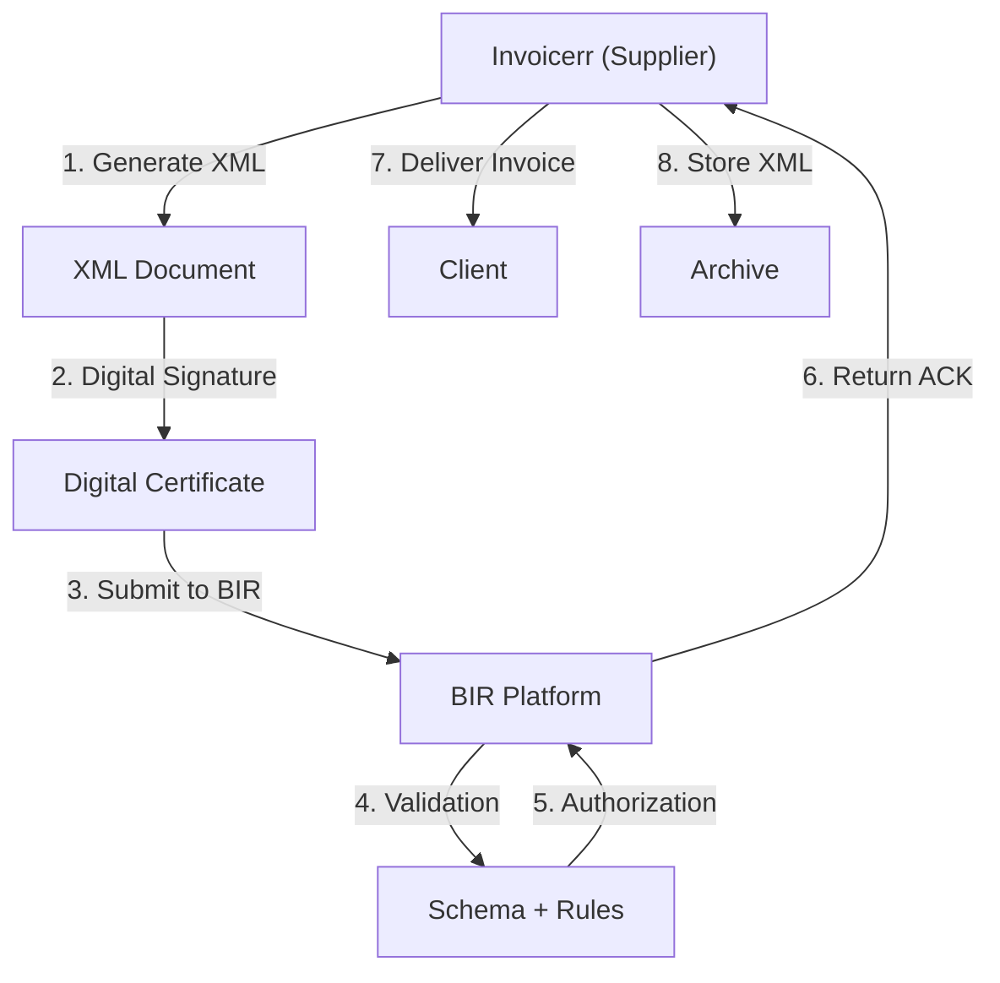

# 🇵🇭 Philippines - E-Invoicing Specifications (BIR e-Invoice)

**Status:** 🟢 **Mandatory** | Active for all businesses
**Authority:** BIR (Bureau of Internal Revenue)
**Platform:** e-Invoice System (PH e-Invoice)

---

## 1. Context & Overview

The Philippines has implemented mandatory e-invoicing through the BIR. All businesses must issue electronic invoices for tax compliance. The system requires BIR accreditation and real-time reporting for VAT purposes.

| Date | Scope | Obligation |
| --- | --- | --- |
| **2018+** | Progressive | Initial mandatory rollout |
| **Ongoing** | All businesses | Continuous BIR compliance |
| **Current** | Full mandatory | All transaction types |

---

## 2. Technical Workflow (Clearance Model)

### 🧱 Key Components

1. **TIN (Tax Identification Number):** 12 digits
2. **Digital Certificate:** BIR-approved
3. **BIR Accreditation:** Required for software
4. **Invoice Type:** VAT/Non-VAT

---

## 3. Data Standards & Formats

### A. Required Format

- **XML Format:** BIR schema
- **Encoding:** UTF-8
- **Digital Signature:** Required

### B. Document Types

| Type | Description |
| --- | --- |
| **Invoice** | Standard sales invoice |
| **Official Receipt** | Payment receipt |
| **Credit Memo** | Adjustments |
| **Debit Memo** | Adjustments |

### C. Critical Data Fields

- **TIN:** Tax ID (12 digits)
- **BIR Accreditation Number:** Software registration
- **VAT Rate:** 12% standard
- **Invoice Date:** MM/DD/YYYY format

---

## 4. Business Model & Compliance

### A. Workflow

1. **TIN Registration:** Obtain BIR tax ID
2. **Accreditation:** Get BIR software accreditation
3. **Certificate:** Acquire digital certificate
4. **XML Generation:** Create BIR-compliant document
5. **Signing:** Apply electronic signature
6. **Submission:** Send to BIR
7. **Delivery:** Send to buyer

### B. Archiving

- **Retention:** 5 years
- **Format:** Original XML

---

## 5. Implementation Checklist

- [ ] **TIN Registration:** Obtain Philippine tax ID
- [ ] **BIR Accreditation:** Get software approval
- [ ] **Digital Certificate:** Acquire BIR certificate
- [ ] **XML Engine:** Build BIR schema generator
- [ ] **Signature Integration:** Implement signing
- [ ] **BIR API:** Connect to e-Invoice system

---

## 6. Resources

- **BIR Portal:** [Bir.gov.ph](https://www.bir.gov.ph)
- **e-Invoicing Section:** [BIR e-Invoice](https://www.bir.gov.ph/eselectronic/)
